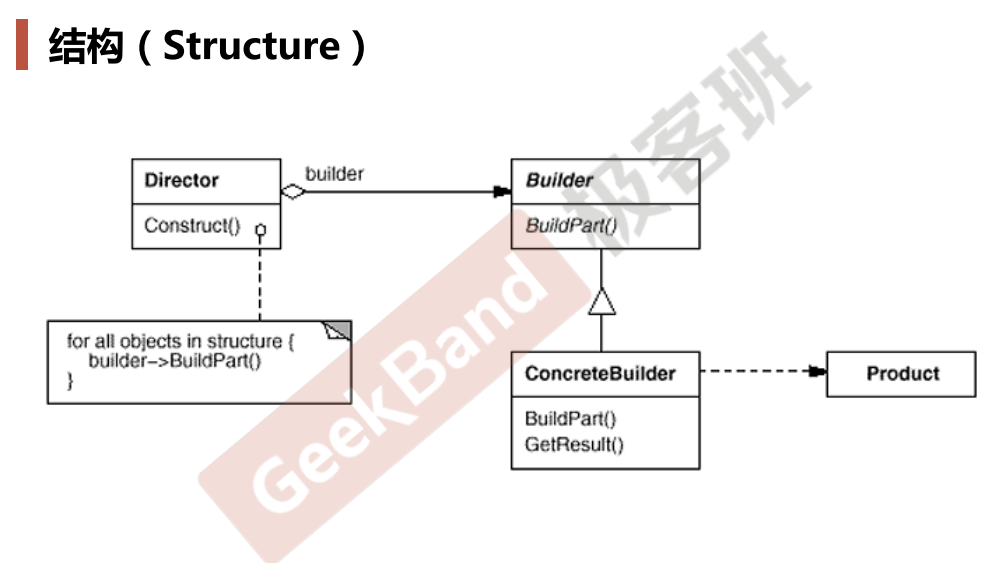

# Bulider

## 动机

* 在软件系统中，**有时候面临着“一个复杂对象”的创建工作**，其通常由各个部分的子对象用一定的算法构成；由于需求的变化，**这个复杂对象的各个部分经常面临着剧烈的变化，但是将它们组合在一起的算法却相对稳定**。
* 如何应对这种变化？如何提供一种“封装机制”来隔离出“复杂对象的各个部分”的变化，从而保持系统中的“稳定构建算法”不随着需求改变而改变？

## 案例

* 案例：在游戏中建房子（房子有各种类型，豪华房、茅草屋、……），房子有固定的构建流程（地板、四面墙、……）
* 思路
  * 定义1个House虚基类，然后有StoneHouse等子类
  * 定义1个HouseBulider虚基类（其中组合了1个House指针指向该House子类的对象，然后还有一系列构造house所需的虚函数，这些虚函数由HouseBulider子类实现），为每个House子类定义对应的HouseBuilder子类
  * 定义1个HouseDirector，其中组合了1个HouseBulider指针指向某个HouseBulider子类的对象，有construct方法用于创建House（调用HouseBulider子类对象的一系列具体实现方法）、有getResult方法用于返回创建好的house的指针
  * House虚基类、HouseBulider虚基类、HouseDirector类都是稳定的，House子类和HouseBulid子类是变化的，这样将一系列关于创建房间的代码给解耦，避免1个类负责太多功能
  * 有些时候将HouseBuilder和HouseDirector合并也没关系，看系统复杂程度，重构就是将复杂的类拆分、将简单的类合并

## 模式定义

将一个复杂对象的构建（HouseBuilder子类）与其表示（House子类）相分离，使得同样的构建过程(稳定)可以创建不同的表示(变化)。

## 模式结构

## 要点总结

* Builder模式主要用于“分步骤构建一个复杂的对象”。在这其中 “分步骤”是一个稳定的算法，而复杂对象的各个部分则经常变化。
* 变化点在哪里，封装哪里——Builder模式主要在于应对“复杂对象各个部分”的频繁需求变动。其缺点在于难以应对“分步骤构建算法”的需求变动。
* 在Builder模式中，要注意不同语言中构造器内调用虚函数的差别 （C++ vs. C#) 。
* 注：C++里，构造函数调用某个虚函数，则是静态绑定（不会调用子类对该虚函数的具体实现），但其它语言中并非这样，这其中是有具体原因的

## 代码

https://github.com/chouxianyu/design-patterns-cpp/tree/master/Builder
