学习《设计模式》目的 不是为了强行使用。

而是在看到任何框架、库，都快速把握其设计思想。
在需要重构的时候，知道怎么重构

# 1. 过程 对象 模块 组件 系统

全都不稳定， 就没有合适的模式（固定）
全都稳定， 就直接写就行

## 1.1. 组件协作3

- **“组件协作”模式** ：现代软件专业分工之后的第一个结果是“框架与应用程序的划分”，“组件协作”模式通过晚期绑定，来实现**框架与应用程序**之间的松耦合，是二者之间协作时常用的模式。

策略
|-- 模板
|-- 观察

### 1.1.1.  1 Template Method

- Template Method
  - [Template Method](docs/TemplateMethod.md)
    - 思想：
      - 框架vs应用程序
      - 松耦合/分离
      - 多个步骤
      - 只见树木不见森林
    - 原则：
      - 开闭原则 Open/Closed Principle
      - 开闭原则的核心思想是：软件实体（类、模块、函数等）应该对扩展开放，对修改关闭。
    - 
    - 具体应用：过程
    - 具体应用：对象
    - 具体应用：组件
    - 具体应用：系统
      - python Flask 框架
      - python Scrapy 框架
      - python pytorch 框架

### 1.1.2.  2 Strategy

- Strategy
  - [Strategy](docs/Strategy.md)
    - 思想：
      - 消除条件判断语句
      - if-elif
      - switch
    - 原则：
      - 依赖倒转  DIP
      - 开闭原则 Open/Closed Principle
    - 
    - 具体应用：过程
      - 操作系统  注册  中断服务调用函数
      - 操作系统  注册  进程策略选择
      - 操作系统  抽象文件接口  socket memory file IO read/write/seek
    - 具体应用：对象
    - 具体应用：组件
    - 具体应用：系统
      - OS 策略与机制 相分离
        - 机制 Mechanism：底层，实现功能的具体**执行结构**的设计，相当于是在**执行决策**
        - 策略 Policy：高层，达到目标功能而选择的**参数、算法**等抽象设计，相当于是在**制定决策**
      - 现代操作系统
        - 在现代操作系统的结构设计中，经常利用“机制与策略分离”的原理来构造OS结构。所谓机制，是指实现某一功能的具体执行机构。而策略，则是在机制基础上，借助于某些参数和算法来实现该功能的优化，或达到不同的功能目标。通常，**机制**处于一个**系统**的基层，而**策略**则处于系统的**高层**。
        - 策略的变化要远远大于机制的变化。将两者分离，可以使机制相对保持稳定，而同时支持策略的变化。
        - https://blog.csdn.net/lianhunqianr1/article/details/118688268
      - netfilter框架
      - MVC框架
        - View，Model属于**策略**，在系统中属于可变部分，Controller属于**机制**，不会随着view的变化而变化，属于系统中不变的部分，构建一个系统要尽肯能分离可变部分和不可变部分。
      - TCP/IP 网络架构
      - TCP拥塞控制框架
      - eBPF框架
        - **内核**实现BPF虚拟机执行核心引擎，属于**机制**部分；
        - **用户态**可以编写各种BPF程序，实现不同**策略功能**；
        - 内核态固定， 用户态编写
        - 柏克莱封包过滤器（Berkeley Packet Filter，缩写 BPF），是类Unix系统上数据链路层的一种原始接口，提供原始链路层封包的收发，除此之外，如果网卡驱动支持洪泛模式，那么它可以让网卡处于此种模式，这样可以收到网络上的所有包，不管他们的目的地是不是所在主机。
        - https://baike.baidu.com/item/bpf/5307621?fr=ge_ala
      - 游戏引擎架构
        - 游戏引擎便是专门为游戏而设计的工具及技术集成，之所以称为引擎，如同交通工具中的引擎，提供了最**核心**的技术部分--**游戏机制**，然后可以通过脚本语言或者关卡设计来插入**策略逻辑**，重用性是游戏引擎的一个重要设计目标，这样很多游戏开发都可以通过"**换皮策略**"来快速开发新游戏。
      - 中间件
        - https://zhuanlan.zhihu.com/p/657450345
        - **分布式** 系统 **中间件**是在 **应用层** 和 **系统层** 之间的连接层。
        - 我们需要一个中间件在 “**应用**程序-**分布式**平台” 之间提供**透明性**，一定程度上向用户的应用程序**隐藏数据**与程序的**分布式**特性。
        - 这一层复杂**多变**的是分布式的**用户程序**，
        - 相对**不变**的是**分布式结构与操作系统**。
        - **中间件**就相当于一种**机制**，
        - 为分布式系统程序、用户的分布式**应用程序**等上层**策略** 提供通用的分布系统服务。
        - 中间件基本脱离于具体设计目标，而提供了普遍独立功能需求的模块，很明显体现出分离。
        - 中间件本身也要求是可以更换的，对不同硬件与可移植的，这让我们来到了下一层。
      - 中断器 / 代理
        - 中断器 Interceptors 是一种软件结构，它能够中断正常的控制流而允许其他代码运行。它可以用在基于对象的分布式系统中，实现对象中间件的功能，在不同物理机器上进行远程对象调用。
        1) 本地应用程序中的对象 A 提供一个接口，该接口和另一个机器上的对象 B 提供接口完全相同，A 只需要调用该接口中的一个方法变量即可。
        2) A 的调用被中断器中断，转换为一个通用的对象激活，这可以通过由与 A 在同一台机器的中间件所提供的对象激活接口来完成。
        3) 该通用对象激活再被中断转换为一个系统级消息，该消息可以通过由 A 的本地 OS 所提供的传输层网络接口来完成。
        - 这就在基于对象的分布式系统中实现了远程对象调用，向用户隐藏了 A, B 对象其实是分布存储的事实。
        - 对象中间件的分布式结构、基于对象的特性都是中间件的功能 **策略**；
        - 而中断器是实现这类中间件的底层组件，实现了一种接口调用的映射，可以说是提供给中间件的 **机制**。
        - 即使更换为其他的中间件，也仍可以使用中断器作为实现 **机制**。
      - 计算反射 / 计算映像
        - 分布式系统所运行的环境，即系统体系结构等，也是不断变化的。这一层的复杂多变在于更底层的操作系统，网络服务，甚至于硬件架构。对这些变化的处理不是由应用程序负责，而是要求中间件有自适应的能力。
        - 计算反射就属于是动态自适应技术的一种，属于是语言本身的能力，在程序运行的时候能够动态检查自己源程序并自行进行调整。Java, python 和 C# 都支持计算反射，它们在执行时都有一个虚拟机 (Virtual Machine) 系统来实现这一点，比如 JVM, Python VM 等。
        - JVM 架构
          - 与 C 程序先编译后运行的方式不同，这些语言没有 "静态处理" 环节，而是在运行时通过 VM 将源代码转化为字节码，然后由执行引擎动态翻译为底层机器指令。这个过程中 VM 可以根据已经执行的结果，runtime 地对字节码进行修改，这就叫做计算反射。有以下例子：
          - python 无类型语言，对变量类型的判断，就是在 VM 中利用了已执行的结果实现的。
          - python 还有 @ 的自动推断，由 VM 进行推断，然后对字节码的这部分进行替换。
          - 在一个进程中可以查询当前已创建的对象有哪些，提供的方法有哪些。VM 能够维护这些抽象数据结构的表，并向上提供查询接口。
          - 之前使用过 jupyter notebook 的查看变量功能，看来这是直接利用了 python VM 的功能，不需要额外进行代码处理。这对于面向对象编程还是很强大的，能够实现数据结构对象的动态管理，反观 C/C++ 等语言在编译之后就看不到任何的高级抽象信息了。
          - 我们回到分布式系统当中，
            - **计算反射**能够在**不同**的**硬件架构**与**系统环境**下，对**字节码**打上补丁，
            - 以实现了**底层**的**动态**自适应能力，
            - 让代码能够高效地在分布式系统**体系结构**之间**迁移**。
            - 对于**中间件**的自适应能力来说，
            - **计算反射**可以说是一种实现的 **机制**，
            - 而上层的自适应**中间件**是 **策略**，在考虑哪些底层组件需要自适应的时候，无需在系统内编写对这些组件的支持，而是选择使用计算反射的这部分能力即可。
          - 另外，面向对象的中间件也可以利用 VM 所维护的对象结构，以在远程机器中找到对应的对象，从而实现远程调用。
      - 对比：
        - **接口和实现** 的分离是“我**不需要知道**汽车是如何工作的才能驾驶它”。如果您知道如何驾驶汽油动力前轮驱动掀背车，并且您被要求驾驶电动后轮驱动轿跑车，则性能特征可能与您习惯的不同，但从根本上说，您使用基本相同的方向盘、踏板和电灯开关等来操作两辆车，即使它们的**实施细节 不同**。只有当您与具有实现依赖关系的车辆进行交互（例如加油）时，您才会注意到差异。
        - **机制与政策** 的分离是，汽车被设计为在它所指向的任何方向上都能达到每小时 100 英里，驾驶员负责以**正确的速度**在高速公路上以正确的方式行驶，而不是汽车。关于**限速是多少**以及**何时允许您左转**的**政策**并未嵌入到发动机中，除非发动机是由知道可能颁布的政策的人设计的。

### 1.1.3.  3 Observer / Event

- Observer / Event
  - [Observer / Event](docs/Observer.md)
    - 思想：
      - 种一对多（变化）的依赖关系
      - 观察+通知
      - 监听事件
      - 发布订阅
    - 原则：
      - **“依赖倒置原则”（Dependency Inversion Principle）和“开闭原则”（Open/Closed Principle）**
      - 依赖倒置原
        - 高层模块不应该依赖低层模块，二者都应该依赖其抽象。
        - 抽象不应该依赖细节，细节应该依赖抽象。
      - 开闭原则
        - 软件实体（类、模块、函数等）应该对扩展开放，对修改关闭。
    - 
    - 具体应用：过程
      - 操作系统  注册  中断服务调用函数
    - 具体应用：对象
      - 观察者      observer/updater    继承interface_processor
      - 发布/通知者 subject/Notifier    fileSplit对象（主体） notify函数遍历observer_vector
      - fileSplit对象（主体） 添加add多少个观察者进行遍历都可以
    - 具体应用：组件
      - Java中 listener 机制
      - C#中 世界中的 Event模式
      - UI框架
      - Qt 信号与槽函数
      - MVC模式
    - 具体应用：系统
      - ROS 话题消息的发布订阅

## 1.2. 单一职责2

- **“单一职责”模式：** 在软件组件的设计中，如果责任划分的不清晰，使用继承得到的 结果往往是随着需求的变化，子类急剧膨胀，同时充斥着重复代码， 这时候的关键是划清责任

装饰器(组合自己)
|-- 桥接(组合其他)

### 1.2.1.  4 Decorator

- Decorator
  - [Decorator](docs/Decorator.md)
    - 思想：
      - **业务逻辑和平台实现** 独立变化
      - 子类 继承 急剧膨胀 （没有划分清楚责任）
      - 解决 过度使用继承问题
      - 解决 主体类 在多个方向的扩展功能
      - 同时使用 组合+继承
      - 组合(主题操作：调用具体类,构造函数参数初始化)
      - 继承(扩展操作：接口)
    - 动态分析
      - 编译时装配
      - 静态继承
      - Stream  ::   Write(data);//写文件流
      - ------ vs -------
      - 运行时装配
      - 动态指针
      - stream  ->   Write(data);//写文件流
    - 复杂度 分析
      - 1 + n + n * 阶乘 m!/2
      - 
      - 1 + n + 1 + 加法 m
      - 
    - 原则：
    - 
    - 具体应用：过程
      - python 函数装饰器 @wrapper
    - 具体应用：对象
      - mpc 典型场景生成 : 碰撞检测判断 障碍物生成 起始位置生成
    - 具体应用：组件
    - 具体应用：系统

### 1.2.2.  5 Bridge

- Bridge
  - [Bridge](docs/Bridge.md)
    - 思想：
      - 类似 C++中的 多继承的方案 ，
      - 但是有不违和， 实现不了的纯虚函数、抽象接口，
      - 解决了 继承 灾难。
      - 两个非常强的 **变化维度**
      - 不同的变化方向( 业务[用户软件] 和 平台[基础硬件] )
      - 编译时装配-->运行时装配
      - 组合技术
        - 把其他维度变化的东西， 
        - 打包成一/N个基类 xxImp 、 yyImp 、 zzImp， 
        - abs业务基类 用一/N个抽象指针指向 xxImp 、 yyImp 、 zzImp 平台基类
    - 复杂度 分析
      - 1 + n + n*m
      - 1 + n + m
      - //平台实现 n
      - //业务抽象 m [组合平台类:成员函数]调用不同平台类的平台函数
    - 
    - 原则：
    - 具体应用：过程
    - 具体应用：对象
    - 具体应用：组件
      - 百度地图的 桥接器 (调用底层基础设)
    - 具体应用：系统

## 1.3. 对象创建4

- **“对象创建”模式** ：绕开“new”来避免对象创建（new）过程 中所导致的紧耦合（编译时依赖具体实现类），从而支持对象创建的稳定。它是接口抽象之后的第一步工作

工厂
|-- 抽象工厂
|-- 原型
|-- 构建≈模板

### 1.3.1.  6 Factory

- Factory
  - [Factory](docs/Factory.md)
    - 思想： 
      - 面向接口编程、变量声明为抽象基类
      - 接口抽象， 之后的 第一个 工作
      - 不能 只管等号左边， 不管等号右边[ 父类指针 指向子类函数 ] 
      - 要把 两边都要变成 接口
      - 多态 new
      - 不是消灭变化， 不是把依赖具体类消灭
      - 而是把变化==具体类， 赶到一个局部地方
      - 把 变化 这只猫咪 关到笼子里， 不让它跳来跳去
      - 通过面向对象手法， 将创建延迟到子类 ， 扩展 而非 更改
    - 原则：
      - 依赖倒转原则
        - 依赖抽象(父类指针)
        - 不应该依赖细节(new子类)
        - 代码中 new 子类 是 细节依赖， 依赖了具体的类
        - 打破了依赖倒转原则
        - 编译的时候， 细节依赖， 违背 依赖倒转原则
    - 
    - 具体应用：过程
    - 具体应用：对象
    - 具体应用：组件
    - 具体应用：系统

### 1.3.2.  7 Abstract Factory

- Abstract Factory
  - [Abstract Factory](docs/AbstractFactory.md)
    - 思想：
      - 一系列相互依赖的对象， 同一个产品的约束
      - 构造函数中 传入 多个成员属性对应的工厂
      - 家族工厂 ： 同一个 数据库品牌 的所有操作
      - 一个接口/抽象类 ， 多个纯虚函数 创建 多个方法
      - 某个系列 / 产品族， 有相互依赖关系
    - 优点：
      - 应对新系列 需求变动
      - 抽象工厂的抽象基类 是稳定不变的
    - 缺陷：
      - 难以应对新对象 需求变动
    - 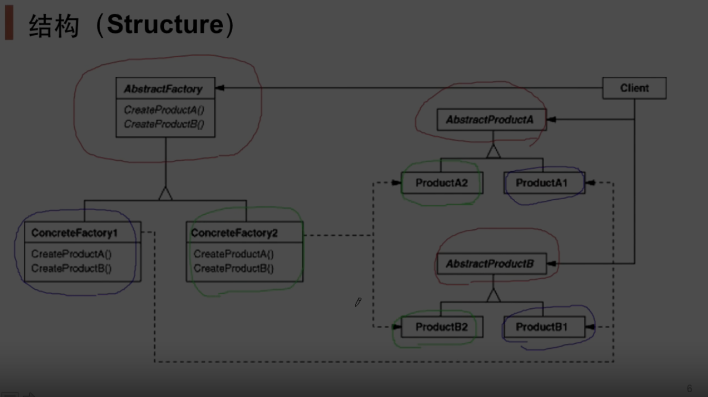
    - 原则：
    - 具体应用：过程
    - 具体应用：对象
    - 具体应用：组件
    - 具体应用：系统

### 1.3.3.  8 Prototype

- Prototype
  - [Prototype](docs/Prototype.md)
    - 思想：
      - 通过克隆自己
      - 深度克隆 ： 需要实现自己的 拷贝构造函数
      - virtual ISplitter\* clone_func() {return new VideoSplitter( \*this ) ; }
      - 原型对象 不是直接拿过来使用的
      - 而是先克隆 再使用的
      - ISplitter* splitter=prototype->clone(); // 克隆原型
      - 创建的结构比较复杂
      - 需要保留中间状态
      - clone C++中拷贝构造函数 （序列化没那么容易， 需要其他库） 
      - clone Java python 有序列化。
    - 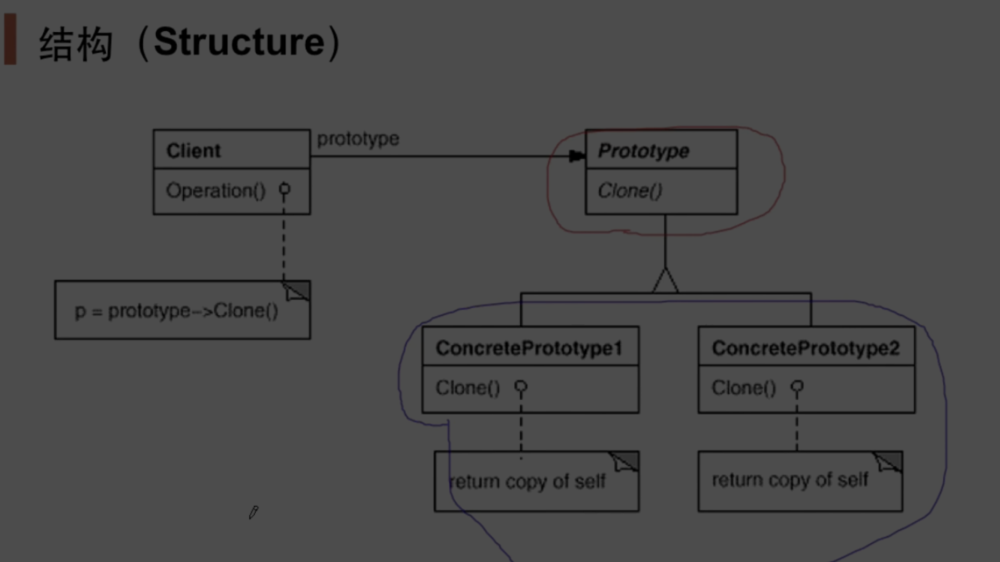
    - 原则：
    - 具体应用：过程
    - 具体应用：对象
    - 具体应用：组件
    - 具体应用：系统

### 1.3.4.  9 Builder

- Builder
  - [Builder](docs/Bulider.md)
    - 思想：
      - 复杂对象
      - 有一定算法
      - 模板方法模式中 遇到 类似
      - 变化：对象各个部分
      - 稳定：组合算法
      - 不能使用构造函数
      - C++ 中 构造函数 调用虚函数 完成的是 静态绑定
      - C++ 中 构造函数 调用虚函数 实际上不回调用子类的 虚函数
      - 先生下来， 才能行使 虚函数 行为
      - Java C# 是可以这样， 但是 C++不可以
      - C++ 中需要写一个 Init() Construct 函数， 不能使用构造函数
      - 构建 过程（稳定 HouseBuilder）， 构建 表示（变化 House） 分离
      - 虚函数 要求 参数稳定、 返回值稳定
    - 升级：
      - 使用 一个 Director 普通构造Construct()
      - Director 的构造函数 传入 成员变量指针 Builder*
    - 原则：
    - 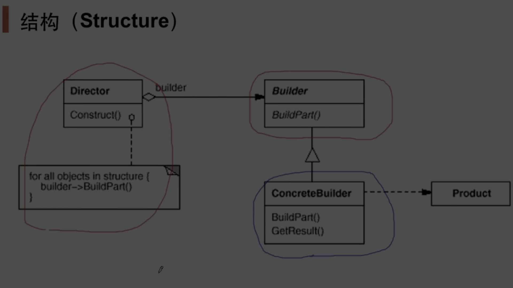
    - 具体应用：过程
    - 具体应用：对象
    - 具体应用：组件
    - 具体应用：系统

## 1.4. 对象性能2

- **“对象性能”模式** ：面向对象很好地解决了“抽象”的问题，但是不可避免地要付出一定的代价。对于通常情况来讲，面向对象的成本大都可以忽略不计。但是某些情况，面向对象所带来的成本必须谨慎处理。

倍乘效应

单例
|-- 享元

### 1.4.1. 10 Singleton

- Singleton
  - [Singleton](docs/Singleton.md)
    - 思想：
      - 只有一个
      - 默认 C++ 会 生成 **公有的** 拷贝构造 和 构造函数
      - **公有** 静态变量 函数+属性
      - 线程非安全
      - 双检查锁 ： 锁前锁后 都进行 if 检查 ，提高效率， 减少上锁
      - 锁前判断 保证 线程安全正确 ， 判断是读取， 不需要枷锁
      - 锁后判断 保证 只 new 一次 ， 判断是改写， 是临界区域
      - 不好， new之后， 只读不需要lock：zyt 或者使用作用域隔离 ， 使用 花括号 结束 lock 的生命周期
      - 双检查锁 问题： 内存读写 reoder
        - 汇编、机器指令 ： 线程 在这个层次抢占时间片
        - new 三步： 
          - 1.分配内存
          - 2.调用 singleton 构造器 ， 一般对内存初始化
          - 3.**把地址指针 返回给 instance 指针**
        - 在CPU 指令层面
        - 这三步可能被 reorder
          - 1.分配内存
          - 3.**把地址指针 返回给 instance 指针**
          - 2.调用 singleton 构造器 ， 一般对内存初始化
        - 从 123 变成了 132
        - 这里是 有可能 或者说是  很有可能
        - 编译器优化 、 汇编执行流水线？
        - 不同CPU实验证明 确实有这问题
        - C++ 、 Java 、 C# 都会有这样问题
        - 返回了指针， 但是不是 NULL
        - thread A 拿到 内存。 
        - thread B 只是拿到原生内存， 并没有执行构造器
        - 双检查锁 欺骗了 thread B
        - 编译器 厂商 解决了这个问题 reorder 问题
        - Java C# 就增加了一个关键字 volatile
        - 编译器 看到 volatile 就不会优化， 进行顺序执行
        - 2005年 微软的 V C++ 实现了 volatile  。 但是不是跨平台的。
        - C++ 11 版本之后才有 volatile 。 
          - //C++ 11版本之后的跨平台实现 (volatile)
          - std::atomic<Singleton*> Singleton::m_instance;
          - std::mutex Singleton::m_mutex;
        - 双重检查锁的漏洞 -- volatile 指令进行重排 
        - https://www.cnblogs.com/lshan/p/16005068.html
    - 原则：
    - 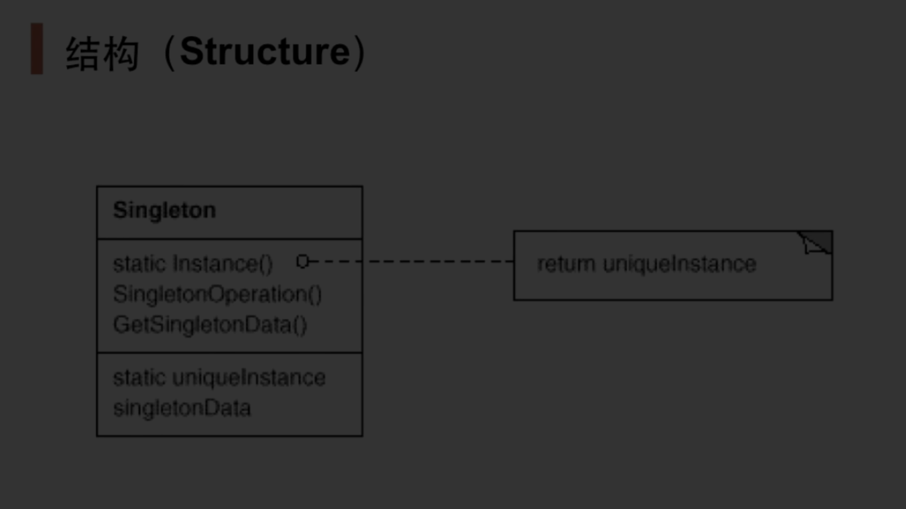
    - 具体应用：过程
    - 具体应用：对象
    - 具体应用：组件
    - 具体应用：系统

### 1.4.2. 11 Flyweight

- Flyweight
  - [Flyweight](docs/Flyweight.md)
    - 思想：
      - 量大 细粒度
      - 运用**共享**技术有效地支持**大量**细粒度的对象
      - 对象池
    - 原则：
    - 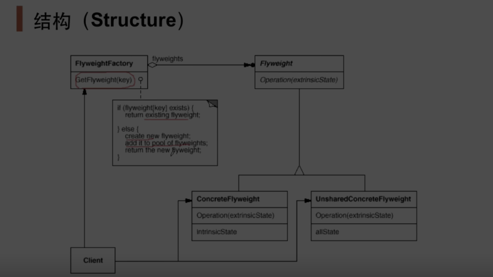
    - 具体应用：过程
    - 具体应用：对象
    - 具体应用：组件
    - 具体应用：系统
    - 具体应用：类库
      - 使用 Proxy Mode 解决 只读 copy on write
      - C++ STL string
    - 具体应用：编译器 JIT编译 层面 
      - 字符串都是只读
      - python str
      - Java string
      - C# string
    - 具体应用：线程池

## 1.5. 接口隔离4

- **“接口隔离”模式** ：在组件构建过程中，某些接口之间直接的依赖常常会带来很多问题、甚至根本无法实现。采用添加一层**稳定/间接**（微观上比如指针，宏观上比如操作系统、虚拟机、依赖倒置原则）接口，来隔离本来互相紧密关联的接口是一种常见的解决方案

门面
|-- 代理
|-- 适配
|-- 中介

### 1.5.1. 12 Facade

- Facade
  - [Facade](docs/Facade.md)
    - 思想：
      - 数据访问： 连接、命令、数据表、参数
      - 外部对象 和 数据对象 直接耦合
      - 一致界面， 一个接口
      - 从架构层次 看待问题
      - 电脑、鼠标、显示器 usb接口
      - 组件内部应该是 耦合关系比较大的
    - 原则：
    - 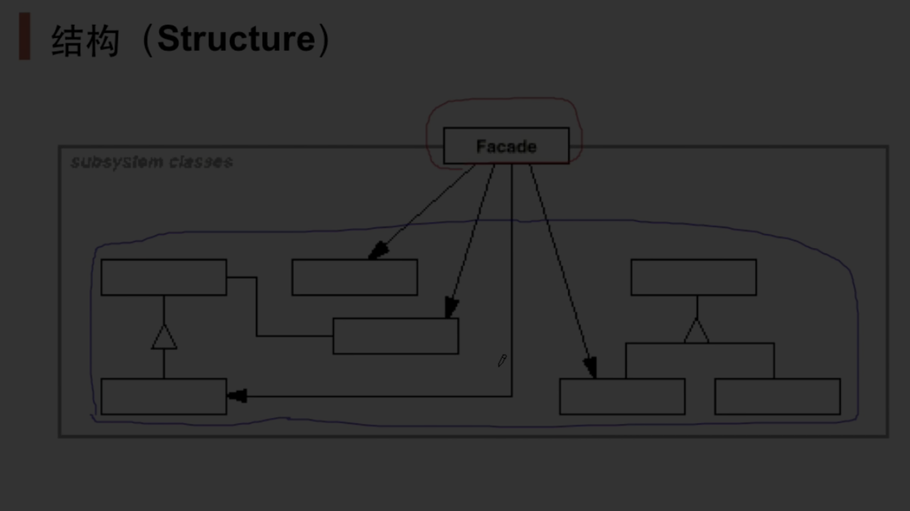
    - 具体应用：过程
    - 具体应用：对象
    - 具体应用：组件
    - 具体应用：系统

### 1.5.2. 13 Proxy

- Proxy
  - [Proxy](docs/Proxy.md)
    - 思想：
      - 需要 开销、安全、进程外、分布式， 进行 透明操作。
      - 不要求接口完全一致 
      - 损失接口 透明性 也是可以。
      - 需要其他层面配合
      - 分布式 通信协议 ， 在架构层 提供 抽象代理层
      - rest架构， 一般都是使用 工具 。
      - 在 分布式代理模式  极其广泛。
      - 具体proxy设计模式的 实现方法、 实现粒度 都相差很大，
      - 有些可能对单个对象做细粒度的控制 ，  
      - 如copy-on-write技术 ， 
      - 有些可能对组件模块提供抽象 代理层，
      - 在架构层次对对象做proxy 。
    - 原则：
    - 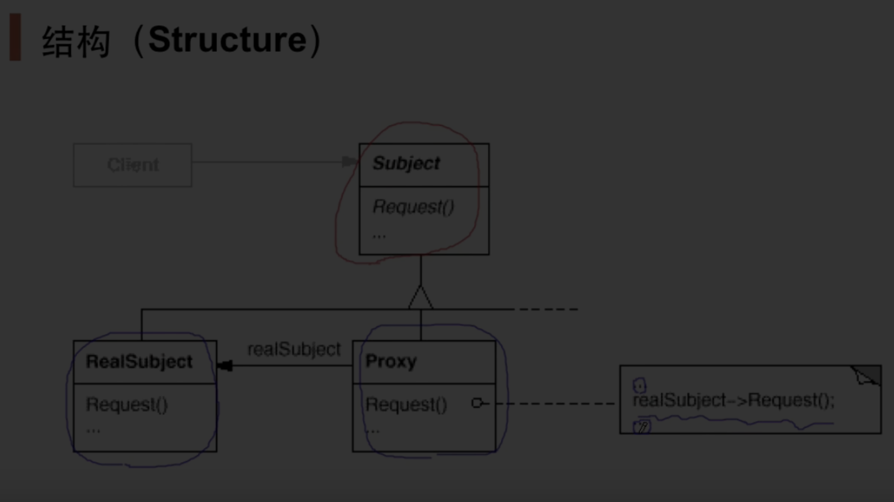
    - 具体应用：过程
    - 具体应用：对象
    - 具体应用：组件
    - 具体应用：系统

### 1.5.3. 14 Adapter

- Adapter
  - [Adapter](docs/Adapter.md)
    - 思想：
      - 新环境
      - 迁移变化
      - C++ STL
      - stack queue 都是用了 deque
      - C++ 中  std::bind
      - 类适配器： 
        - 继承
          - public 接口
          - protected private 实现（功能）
        - 缺点
          - 没有灵活性 ， 继承在 编译时候确定了
      - 对象适配器：
        - 组合
        - 优点
          - 灵活性 ， 随便组合多态
    - 原则：
    - 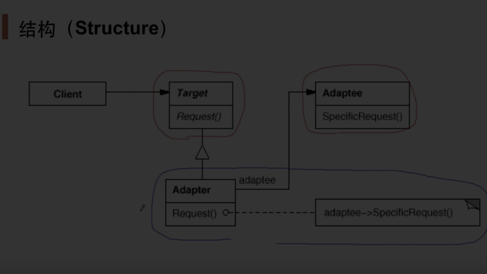
    - 具体应用：过程
    - 具体应用：对象
    - 具体应用：组件
    - 具体应用：系统

### 1.5.4. 15 Mediator

- Mediator
  - [Mediator](docs/Mediator.md)
    - 思想：
      - **多**个对象 交互。
      - 集中管理
      - 
      - UI界面 后面的 datamodel 跟着修改
      - 双向依赖关系。
      - 界面元素 数据模型 之间依赖。
      - 观察者模式的元素 进行通知。
      - 对象绑定协议， 转换 ， 对象通知协议 。
      - 对象 id 属性 属性值 控件 通知协议定义清楚。 
      - 
      - 门面 解决 系统内外      （单向）
      - 中介 解决 系统内部之间  （之间）
      - 
      - 
      - 各个对象不需要显示的引用（编译时依赖）
      - colleague 内部指针 指向 Mediator
      - colleague 之间没有依赖关系
      - colleague 不一定需要继承。
      - 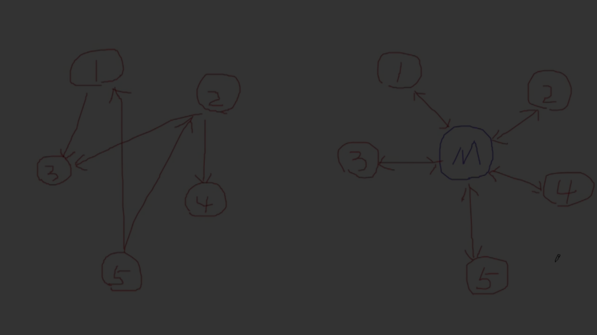
      - 1 通知 M 
      - M 通知 3
      - 调用通知 定义 调用通知的消息规范
    - 原则：
    - 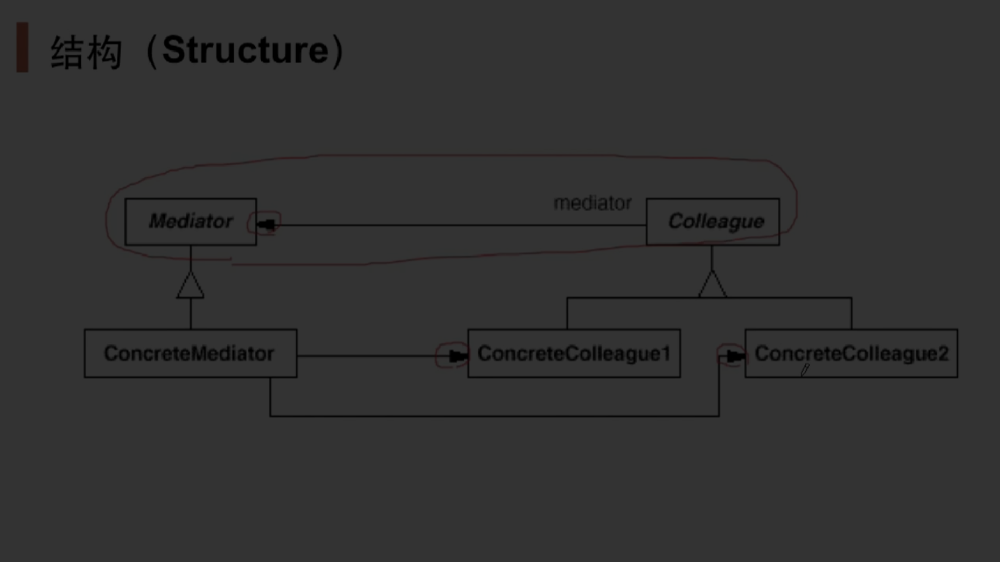
    - 具体应用：过程
    - 具体应用：对象
      - MPC 的UI界面 和 数据模型
      - VUE3 的 数据 代理
      - GO 的 mysql数据结构和类同步 代理
    - 具体应用：组件
      - 星型总线
    - 具体应用：系统
      - ROS 服务器
      - 系统数据绑定模块

## 1.6. 状态变化2

- **“状态变化”模式** ：在组件构建过程中，某些对象的状态经常会变化，如何对这些变化进行有效地管理？同时又维持高层模块的稳定？

### 1.6.1. 16 State

- State
  - [State](docs/State.md)
    - 思想：
      -重构前： state 作为 switch
      -重构前： state 作为 抽象接口的继承
      - 和 strategy 有点像
      - zyt： 最好使用 DSL 形式语言 表示
        - 1. 输出动作 2. 状态转移
        - 3. 输入： 上一个状态 + 输入的终端字符
        - C++ 代码 可以使用 预处理 分为 调试框架print 和 实现函数
        - python 也可以使用 if debug : print + return
    - 原则：
    - 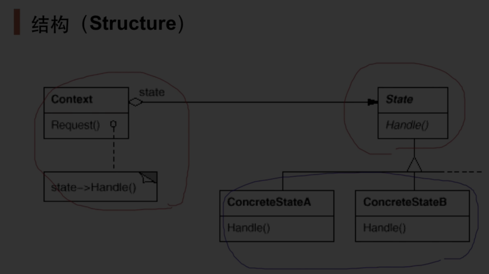
    - 具体应用：过程
    - 具体应用：对象
    - 具体应用：组件
    - 具体应用：系统
      - 集群无人机 状态改变 集合表示

### 1.6.2. 17 Memento

- Memento
  - [Memento](docs/Memento.md)
    - 思想：
      - 状态回溯
      - 在对象之外 保存 对象状态
      - 内存快照
      - 只摘取 有效状态。
      - 不破坏 originator 的封装性。
      - 在该对象之外保存， memento中。
      - 难点在： 什么状态保存？ 保存量级是什么？ 只保存一次还是多次快照？考虑性能
      - 实现上：
        - 字段
        - 内存流 （性能好）
        - 序列化 （性能好）
        - Base64 编码的 字符串
        - python 字典
      - 原发器 创建 备忘录
      - 设计模式 有些过时 94年出版《设计模式》， 95年JAVA
      - 现在 有 序列化技术。
      - 类层级 ， 多级指针 ，深拷贝， 编码效率低。
      - 序列化 效率高。
    - 原则：
    - 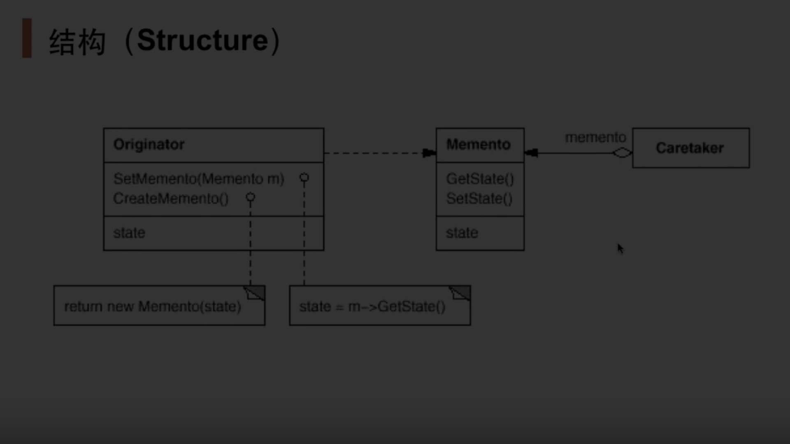
      - 封闭  ： 公有接口不好， 暴露对象实现细节
    - 具体应用：过程
    - 具体应用：对象
    - 具体应用：组件
    - 具体应用：系统

## 1.7. 数据结构3

- **“数据结构”模式** ：一些组件在内部具有特定的数据结构，如果让客户程序依赖这些特定的数据结构，将极大地破坏组件的复用。将这些特定数据结构封装在内部，在外部提供统一的接口，来实现与特定结构无关的访问，是一种行之有效的解决方案

### 1.7.1. 18 Composite

- Composite
  - [Composite](docs/Composite.md)
    - 思想：
      - 将对象组合成树形结构
      - 使用单个对象，还是组合对象， 接口一样
    - 原则：
    - 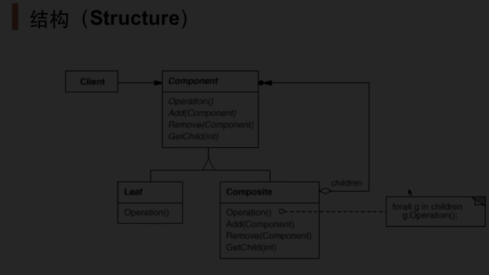
    - 具体应用：过程
    - 具体应用：对象
    - 具体应用：组件
    - 具体应用：系统

### 1.7.2. 19 Iterator

- Iterator
  - [Iterator](docs/Iterator.md)
    - 思想：
      - 访问数据， 不需要知道组织数据的方式（堆栈or其他）
      - 遍历的时候更改 会有问题
      - 所以， 遍历的时候， 一般是只读的
    - 原则：
    - 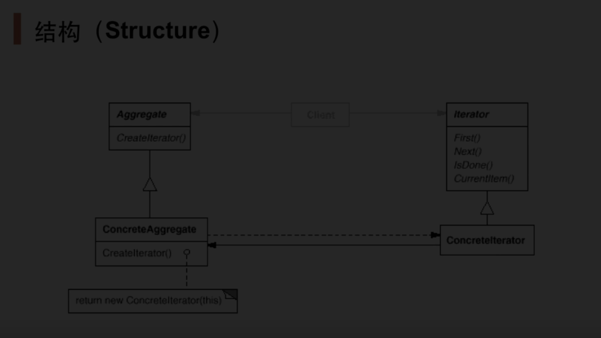
    - 具体应用：过程
    - 具体应用：对象
    - 具体应用：组件
    - 具体应用：系统
    - 具体应用：泛型编程
      - C++ 迭代器
      - 使用模板 （编译时 多态）
      - 98年 STL
      - 面向对象 虚函数性能低 ， 需要计算地址
      - Java C# Php python 还在用 运行时多态

### 1.7.3. 20 Chain of Responsibility

- Chain of Responsibility
  - [Chain of Responsibility](docs/ChainOfResponsibility.md)
    - 思想：
      - windows wps mac OSten LS系统
      - 界面处理逻辑
        - 顶级 windows
        - tables
        - list
        - text box
      - 鼠标点击会一层层向上传播
      - 最后多个对象，从叶子节点看是一个链表树，指向父节点
    - 原则：
    - 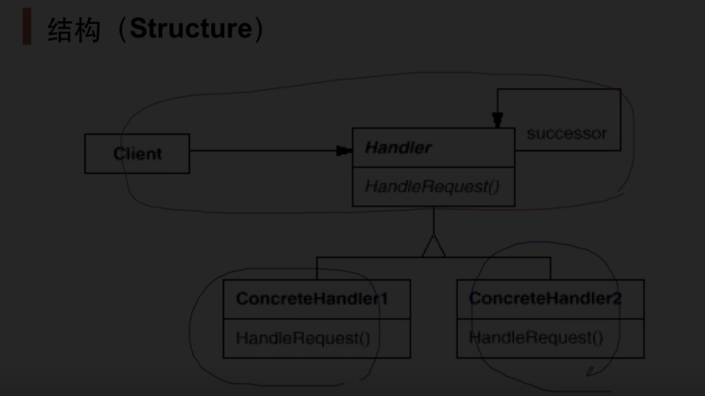
    - 具体应用：过程
    - 具体应用：对象
    - 具体应用：组件
    - 具体应用：系统

## 1.8. 行为变化2

- **“行为变化”模式** ：在组件的构建过程中，组件行为的变化经常导致组件本身剧烈的变化。“行为变化”模式将组件的行为和组件本身进行解耦，从而支持组件行为的变化，实现两者之间的松耦合

### 1.8.1. 21 Command

- Command
  - [Command](docs/Command.md)
    - 思想：
      - 对行为 进行 记录 撤销/重做（undo、redo）
      - 将**请求**封装成对象
      - 不同请求对参数进行参数化
      - 对象 可以
        - 当做参数传递
        - 序列存储
      - 编辑器
        - cut
        - delete
        - paste
        - redo
        - undo
    - 原则：
    - 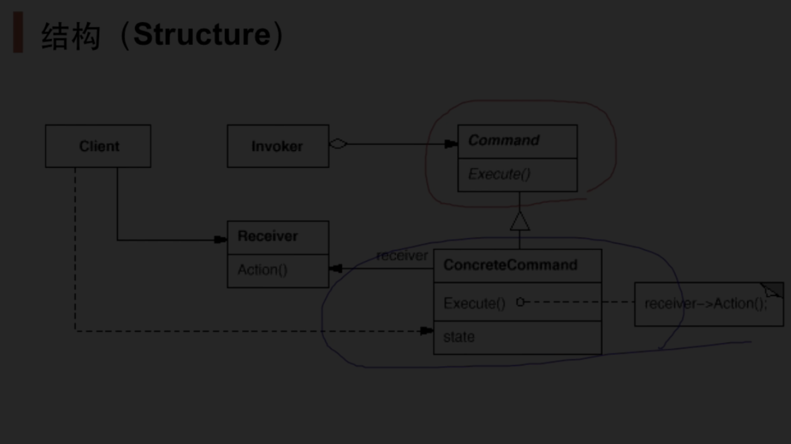
    - 具体应用：过程
    - 具体应用：对象
      - C++ 函数对象 重载括号 操作符
      - 跟泛型编程结合  使用模板  编译时绑定 （快）
      - 98年 泛型编程
      - 将行为 对象化 
      - 将代码 对象化
      - command 接口+实现 更严格
      - command 性能损失
      - C++ **函数对象/仿函数** （配合**模板**使用） 
        - 用**签名函数**定义，是需要 **参数+返回值**一致
        - 名字无所谓， 接口规范灵活
        - 接口规范是 隐式接口 
        - 靠编译器 检查
        - 性能高
      - Java C# swift 这样的语言
    - 具体应用：组件
    - 具体应用：系统

### 1.8.2. 22 Visitor

- Visitor
  - [Visitor](docs/Visitor.md)
    - 思想：
      - element 下面所有的具体类 必须稳定
      - 五个 element 就要  visitor 有 五个方法 
      - 这个数字五 也不能变， 应为每个visitor 都需要遍历每个 element
      - 所以说， element 整个继承树所有子类 ， 都确定， 不能增加子类
      - 图形系统 很难满足
        - shape 基类
        - rectangle 子类
        - circle 子类
        - line 子类
      - 要求子类必须稳定， 常常满足不了
      - zyt：
        - visitor 只有两个函数，
        - 一个测试流程print
        - 一个正式运行excut 
      - 双重分发 double dispatch
        - 两次 多态 的动态辨析
        - 两次 派遣/辨析
      - 在不更改 element **类层次** 的结构前提下
        - 在运行时候 ， 为类的添加行的操作 visit An （实现 element数量个函数）
        - zyt使用情况： 修改为 长方形， 扩宽 或 扩长， 统一一次 就要一排 扩张。
        - element 继承树 的结构稳定
        - 但是操作 visitor 变动 。
      - 这个模式， 一般不用， 一旦使用， 就特别重。 （一定是个矩阵， 每次加 一行 一列）
    - 原则：
    - 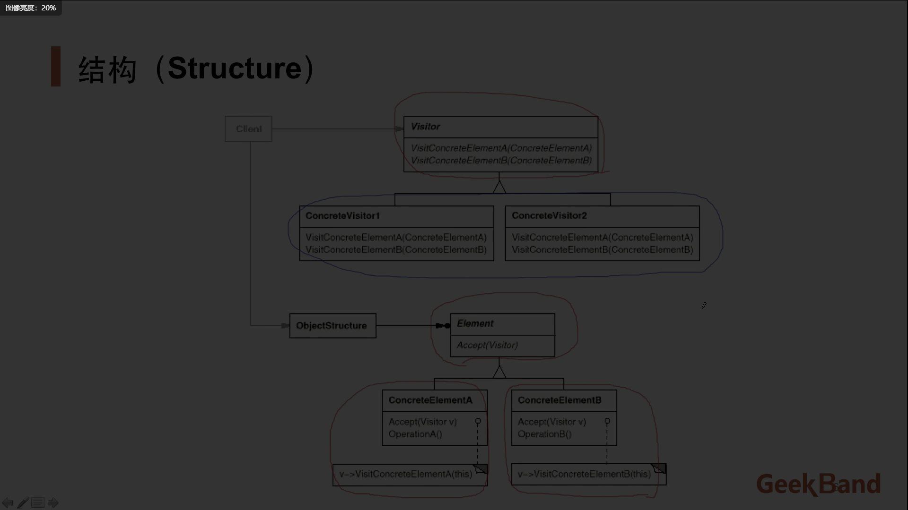
    - 具体应用：过程
    - 具体应用：对象
    - 具体应用：组件
    - 具体应用：系统

## 1.9. 领域规则1

- **“领域规则”模式** ：在特定领域中，某些变化虽然频繁，但可以抽象为某种规则。这时候，结合特定领域，将问题抽象为语法规则，从而给出在该领域下的一般性解决方案。

### 1.9.1. 23 Interpreter

- Interpreter
  - [Interpreter](docs/Interpreter.md)
    - 思想：
      - 定义文法表示
      - 定义解释器
      - 业务平凡变化 
      - 容易抽象为语法规则
      - 大写数字汉字 转换成 数字
      - 适合简单的文法表示
        - 复杂的会产生 很大 的 类层次结构
        - 一旦出错，非常难以调试
      - 需要求助 语法生成器 这样的标准工具
    - 原则：
    - 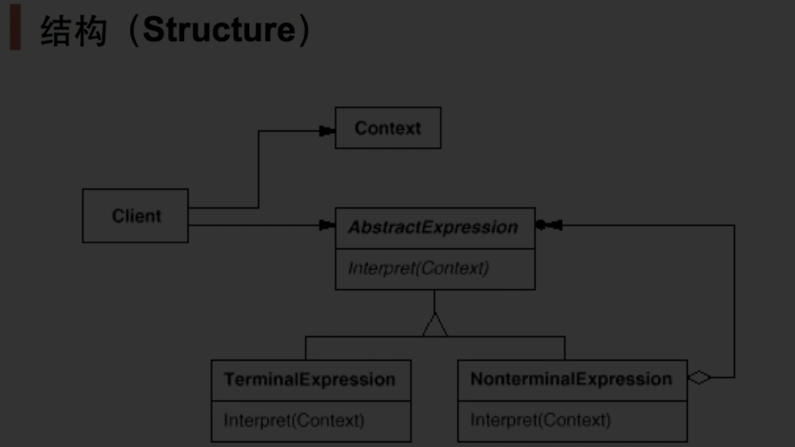
    - 具体应用：过程
    - 具体应用：对象
    - 具体应用：组件
    - 具体应用：系统

## 1.10. 在不同开发层次中使用的设计解耦方法

| 开发层次 | 设计解耦方法   |
| -------- | -------------- |
| 过程     | 回调函数       |
| 对象     | 抽象接口       |
| 库       | 头文件        |
| 模块     | 模板方法模式   |
| 组件     | 依赖注入       |
| 系统     | 服务总线       |
| 领域特定语言DSL | 配置文件       |

过程  回调函数（Callback Functions）
对象  抽象接口（Abstract Interfaces）
库    头文件
模块  模板方法模式（Template Method Pattern）
组件  依赖注入（Dependency Injection, DI）
系统  服务总线（Service Bus）

抽象接口 && 头文件 都是 先声明后使用。

### 1.10.1. 解释

- **过程（Procedure）**：使用回调函数来实现解耦，通过将函数作为参数传递，从而在不同的上下文中执行不同的操作。
- **对象（Object）**：使用抽象接口来实现解耦，通过定义接口并让具体类实现接口，从而在不修改代码的情况下替换实现。
- **模块（Module）**：使用模板方法模式来实现解耦，通过在基类中定义算法的骨架，并将具体的实现延迟到子类中。
- **组件（Component）**：使用依赖注入来实现解耦，通过将组件的依赖注入到组件中，从而在不修改组件代码的情况下替换依赖。
- **系统（System）**：使用服务总线来实现解耦，通过服务总线来协调系统中各个子系统的通信，从而减少子系统之间的直接依赖。

### 1.10.2. 重构 -> 设计模式
### 1.10.3. 设计模式 弥补 编程语言的不足
Builder                 不常用：组合构造算法
Mediator                框架库
Memento                 序列化
Iterator                C++泛型编程 模板
Chain of Resposibility  直接用数据结构
visitor                 慎重， 一旦使用就是重用
command                 函数对象、仿函数（配合模板使用）
Interpreter           小语言

结构都变成
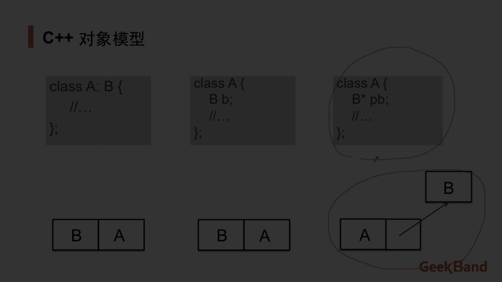

什么时候不用设计模式？（用的时候，必须先解决如下问题）
1. 代码可读性很差时
2. 需求理解还很浅时
3. 变化没有显现时
4. 不是系统的关键依赖点
5. 项目没有复用价值时
6. 项目将要发布时

经验之谈
1. 不要为模式而模式
2. 关注抽象类 & 接口
3. 理清变化点和稳定点
4. 审视依赖关系
5. 要有 Framework 和 Application 的 区隔思维
6. 良好的设计是演化的结果

