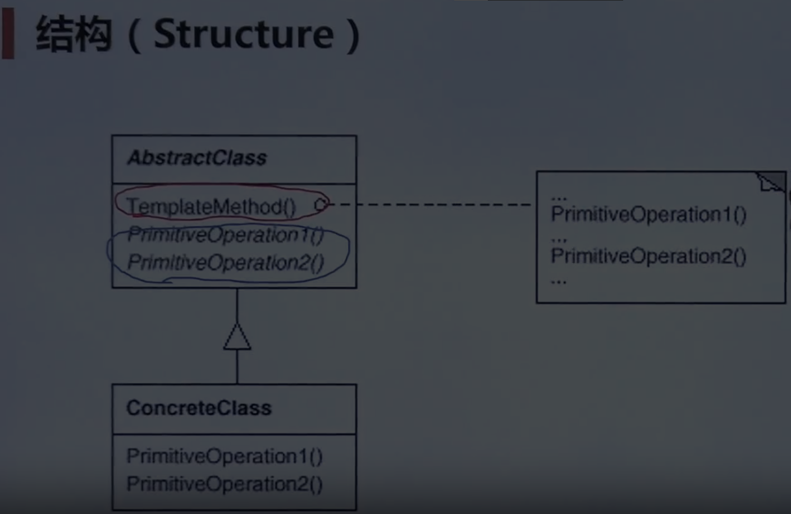
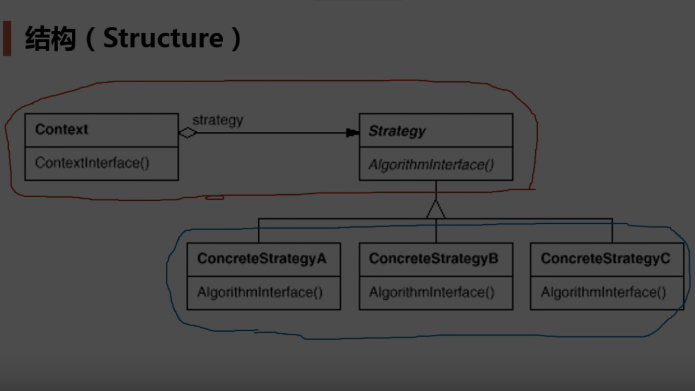
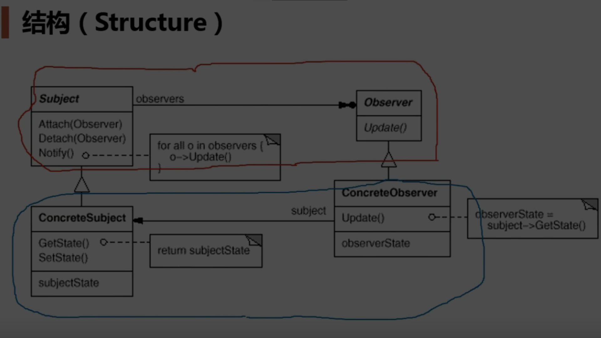
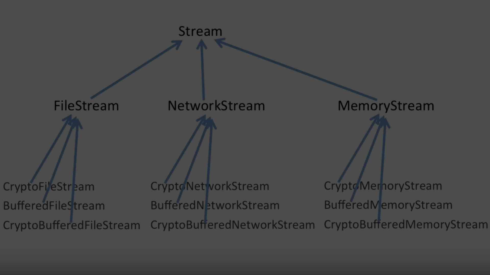
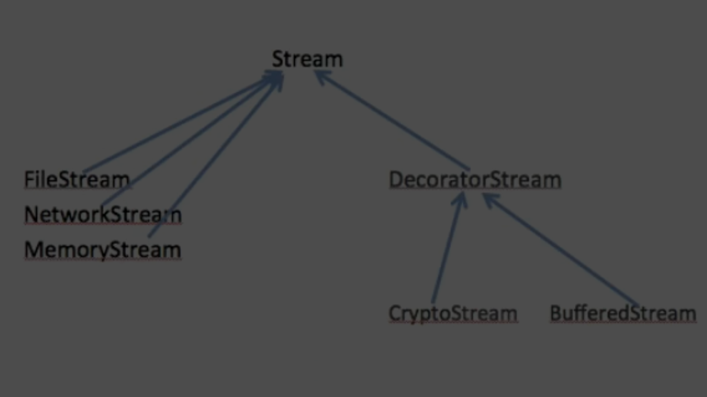
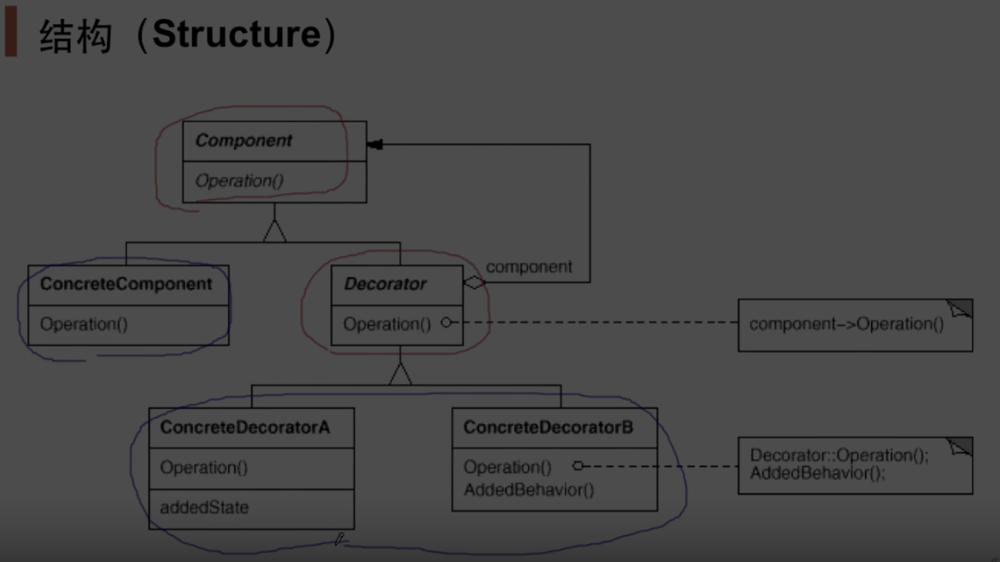

# 过程 对象 模块 组件 系统

## 在不同开发层次中使用的设计解耦方法

| 开发层次 | 设计解耦方法   |
| -------- | -------------- |
| 过程     | 回调函数       |
| 对象     | 抽象接口       |
| 模块     | 模板方法模式   |
| 组件     | 依赖注入       |
| 系统     | 服务总线       |

过程  回调函数（Callback Functions）
对象  抽象接口（Abstract Interfaces）
模块  模板方法模式（Template Method Pattern）
组件  依赖注入（Dependency Injection, DI）
系统  服务总线（Service Bus）

### 解释

- **过程（Procedure）**：使用回调函数来实现解耦，通过将函数作为参数传递，从而在不同的上下文中执行不同的操作。
- **对象（Object）**：使用抽象接口来实现解耦，通过定义接口并让具体类实现接口，从而在不修改代码的情况下替换实现。
- **模块（Module）**：使用模板方法模式来实现解耦，通过在基类中定义算法的骨架，并将具体的实现延迟到子类中。
- **组件（Component）**：使用依赖注入来实现解耦，通过将组件的依赖注入到组件中，从而在不修改组件代码的情况下替换依赖。
- **系统（System）**：使用服务总线来实现解耦，通过服务总线来协调系统中各个子系统的通信，从而减少子系统之间的直接依赖。

## 组件协作

- **“组件协作”模式** ：现代软件专业分工之后的第一个结果是“框架与应用程序的划分”，“组件协作”模式通过晚期绑定，来实现框架与应用程序之间的松耦合，是二者之间协作时常用的模式。
  - [Template Method](docs/TemplateMethod.md)
    - 思想：
      - 框架vs应用程序
      - 松耦合/分离
      - 多个步骤
      - 只见树木不见森林
    - 原则：
      - 开闭原则 Open/Closed Principle
      - 开闭原则的核心思想是：软件实体（类、模块、函数等）应该对扩展开放，对修改关闭。
    - 
    - 具体应用：过程
    - 具体应用：对象
    - 具体应用：组件
    - 具体应用：系统
      - python Flask 框架
      - python Scrapy 框架
      - python pytorch 框架
  - [Strategy](docs/Strategy.md)
    - 思想：
      - 消除条件判断语句
      - if-elif
      - switch
    - 原则：
      - 依赖倒转  DIP
      - 开闭原则 Open/Closed Principle
    - 
    - 具体应用：过程
      - 操作系统  注册  中断服务调用函数
      - 操作系统  注册  进程策略选择
      - 操作系统  抽象文件接口  socket memory file IO read/write/seek
    - 具体应用：对象
    - 具体应用：组件
    - 具体应用：系统
  - [Observer / Event](docs/Observer.md)
    - 思想：
      - 种一对多（变化）的依赖关系
      - 观察+通知
      - 监听事件
      - 发布订阅
    - 原则：
      - **“依赖倒置原则”（Dependency Inversion Principle）和“开闭原则”（Open/Closed Principle）**
      - 依赖倒置原
        - 高层模块不应该依赖低层模块，二者都应该依赖其抽象。
        - 抽象不应该依赖细节，细节应该依赖抽象。
      - 开闭原则
        - 软件实体（类、模块、函数等）应该对扩展开放，对修改关闭。
    - 
    - 具体应用：过程
      - 操作系统  注册  中断服务调用函数
    - 具体应用：对象
      - 观察者      observer/updater    继承interface_processor
      - 发布/通知者 subject/Notifier    fileSplit对象（主体） notify函数遍历observer_vector
      - fileSplit对象（主体） 添加add多少个观察者进行遍历都可以
    - 具体应用：组件
      - Java中 listener 机制
      - C#中 世界中的 Event模式
      - UI框架
      - Qt 信号与槽函数
      - MVC模式
    - 具体应用：系统
      - ROS 话题消息的发布订阅

## 单一职责

- **“单一职责”模式：** 在软件组件的设计中，如果责任划分的不清晰，使用继承得到的 结果往往是随着需求的变化，子类急剧膨胀，同时充斥着重复代码， 这时候的关键是划清责任
  - [Decorator](docs/Decorator.md)
    - 思想：
      - 子类 继承 急剧膨胀 （没有划分清楚责任）
      - 解决 过度使用继承问题
      - 解决 主体类 在多个方向的扩展功能
      - 同时使用 组合+继承
      - 组合(主题操作：调用具体类,构造函数参数初始化)
      - 继承(扩展操作：接口)
    - 动态分析
      - 编译时装配
      - 静态继承
      - Stream  ::   Write(data);//写文件流
      - ------ vs -------
      - 运行时装配
      - 动态指针
      - stream  ->   Write(data);//写文件流
    - 复杂度 分析
      - 1 + n + n * 阶乘 m!/2
      - 
      - 1 + n + 1 + 加法 m
      - 
    - 原则：
    - 
    - 具体应用：过程
      - python 函数装饰器 @wrapper
    - 具体应用：对象
      - mpc 典型场景生成 : 碰撞检测判断 障碍物生成 起始位置生成
      - 
    - 具体应用：组件
    - 具体应用：系统
  - [Bridge](docs/Bridge.md)
    - 思想：
    - 原则：
    - 具体应用：过程
    - 具体应用：对象
    - 具体应用：组件
    - 具体应用：系统

## 对象创建

- **“对象创建”模式** ：绕开“new”来避免对象创建（new）过程 中所导致的紧耦合（编译时依赖具体实现类），从而支持对象创建的稳定。它是接口抽象之后的第一步工作
  - [Factory](docs/Factory.md)
    - 思想：
    - 原则：
    - 具体应用：过程
    - 具体应用：对象
    - 具体应用：组件
    - 具体应用：系统
  - [Abstract Factory](docs/AbstractFactory.md)
    - 思想：
    - 原则：
    - 具体应用：过程
    - 具体应用：对象
    - 具体应用：组件
    - 具体应用：系统
  - [Prototype](docs/Prototype.md)
    - 思想：
    - 原则：
    - 具体应用：过程
    - 具体应用：对象
    - 具体应用：组件
    - 具体应用：系统
  - [Builder](docs/Bulider.md)
    - 思想：
    - 原则：
    - 具体应用：过程
    - 具体应用：对象
    - 具体应用：组件
    - 具体应用：系统

## 对象性能

- **“对象性能”模式** ：面向对象很好地解决了“抽象”的问题，但是不可避免地要付出一定的代价。对于通常情况来讲，面向对象的成本大都可以忽略不计。但是某些情况，面向对象所带来的成本必须谨慎处理。
  - [Singleton](docs/Singleton.md)
    - 思想：
    - 原则：
    - 具体应用：过程
    - 具体应用：对象
    - 具体应用：组件
    - 具体应用：系统
  - [Flyweight](docs/Flyweight.md)
    - 思想：
    - 原则：
    - 具体应用：过程
    - 具体应用：对象
    - 具体应用：组件
    - 具体应用：系统

## 接口隔离

- **“接口隔离”模式** ：在组件构建过程中，某些接口之间直接的依赖常常会带来很多问题、甚至根本无法实现。采用添加一层稳定/间接（微观上比如指针，宏观上比如操作系统、虚拟机、依赖倒置原则）接口，来隔离本来互相紧密关联的接口是一种常见的解决方案
  - [Facade](docs/Facade.md)
    - 思想：
    - 原则：
    - 具体应用：过程
    - 具体应用：对象
    - 具体应用：组件
    - 具体应用：系统
  - [Proxy](docs/Proxy.md)
    - 思想：
    - 原则：
    - 具体应用：过程
    - 具体应用：对象
    - 具体应用：组件
    - 具体应用：系统
  - [Adapter](docs/Adapter.md)
    - 思想：
    - 原则：
    - 具体应用：过程
    - 具体应用：对象
    - 具体应用：组件
    - 具体应用：系统
  - [Mediator](docs/Mediator.md)
    - 思想：
    - 原则：
    - 具体应用：过程
    - 具体应用：对象
    - 具体应用：组件
    - 具体应用：系统

## 状态变化

- **“状态变化”模式** ：在组件构建过程中，某些对象的状态经常会变化，如何对这些变化进行有效地管理？同时又维持高层模块的稳定？
  - [State](docs/State.md)
    - 思想：
    - 原则：
    - 具体应用：过程
    - 具体应用：对象
    - 具体应用：组件
    - 具体应用：系统
  - [Memento](docs/Memento.md)
    - 思想：
    - 原则：
    - 具体应用：过程
    - 具体应用：对象
    - 具体应用：组件
    - 具体应用：系统

## 数据结构

- **“数据结构”模式** ：一些组件在内部具有特定的数据结构，如果让客户程序依赖这些特定的数据结构，将极大地破坏组件的复用。将这些特定数据结构封装在内部，在外部提供统一的接口，来实现与特定结构无关的访问，是一种行之有效的解决方案
  - [Composite](docs/Composite.md)
    - 思想：
    - 原则：
    - 具体应用：过程
    - 具体应用：对象
    - 具体应用：组件
    - 具体应用：系统
  - [Iterator](docs/Iterator.md)
    - 思想：
    - 原则：
    - 具体应用：过程
    - 具体应用：对象
    - 具体应用：组件
    - 具体应用：系统
  - [Chain of Responsibility](docs/ChainOfResponsibility.md)
    - 思想：
    - 原则：
    - 具体应用：过程
    - 具体应用：对象
    - 具体应用：组件
    - 具体应用：系统

## 行为变化

- **“行为变化”模式** ：在组件的构建过程中，组件行为的变化经常导致组件本身剧烈的变化。“行为变化”模式将组件的行为和组件本身进行解耦，从而支持组件行为的变化，实现两者之间的松耦合
  - [Command](docs/Command.md)
    - 思想：
    - 原则：
    - 具体应用：过程
    - 具体应用：对象
    - 具体应用：组件
    - 具体应用：系统
  - [Visitor](docs/Visitor.md)
    - 思想：
    - 原则：
    - 具体应用：过程
    - 具体应用：对象
    - 具体应用：组件
    - 具体应用：系统

## 领域规则

- **“领域规则”模式** ：在特定领域中，某些变化虽然频繁，但可以抽象为某种规则。这时候，结合特定领域，将问题抽象为语法规则，从而给出在该领域下的一般性解决方案。
  - [Interpreter](docs/Interpreter.md)
    - 思想：
    - 原则：
    - 具体应用：过程
    - 具体应用：对象
    - 具体应用：组件
    - 具体应用：系统
