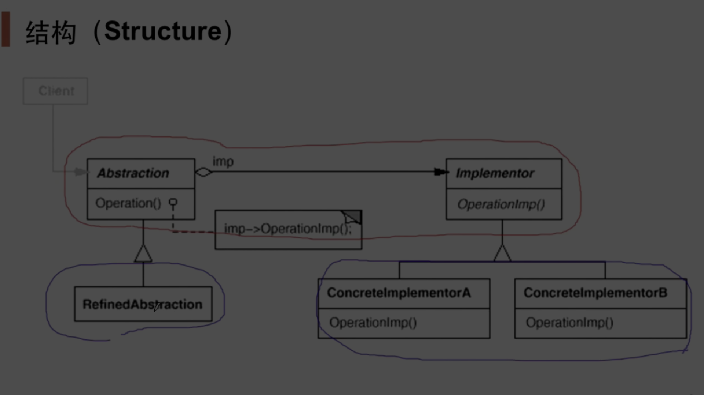
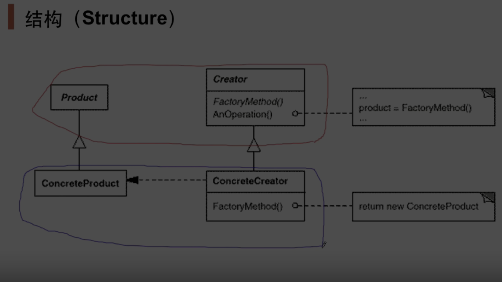

# 1. 过程 对象 模块 组件 系统

## 1.1. 组件协作

- **“组件协作”模式** ：现代软件专业分工之后的第一个结果是“框架与应用程序的划分”，“组件协作”模式通过晚期绑定，来实现**框架与应用程序**之间的松耦合，是二者之间协作时常用的模式。

策略
|-- 模板
|-- 观察

### 1.1.1. Template Method

- Template Method
  - [Template Method](docs/TemplateMethod.md)
    - 思想：
      - 框架vs应用程序
      - 松耦合/分离
      - 多个步骤
      - 只见树木不见森林
    - 原则：
      - 开闭原则 Open/Closed Principle
      - 开闭原则的核心思想是：软件实体（类、模块、函数等）应该对扩展开放，对修改关闭。
    - 
    - 具体应用：过程
    - 具体应用：对象
    - 具体应用：组件
    - 具体应用：系统
      - python Flask 框架
      - python Scrapy 框架
      - python pytorch 框架

### 1.1.2. Strategy

- Strategy
  - [Strategy](docs/Strategy.md)
    - 思想：
      - 消除条件判断语句
      - if-elif
      - switch
    - 原则：
      - 依赖倒转  DIP
      - 开闭原则 Open/Closed Principle
    - 
    - 具体应用：过程
      - 操作系统  注册  中断服务调用函数
      - 操作系统  注册  进程策略选择
      - 操作系统  抽象文件接口  socket memory file IO read/write/seek
    - 具体应用：对象
    - 具体应用：组件
    - 具体应用：系统
      - OS 策略与机制 相分离
        - 机制 Mechanism：底层，实现功能的具体**执行结构**的设计，相当于是在**执行决策**
        - 策略 Policy：高层，达到目标功能而选择的**参数、算法**等抽象设计，相当于是在**制定决策**
      - 现代操作系统
        - 在现代操作系统的结构设计中，经常利用“机制与策略分离”的原理来构造OS结构。所谓机制，是指实现某一功能的具体执行机构。而策略，则是在机制基础上，借助于某些参数和算法来实现该功能的优化，或达到不同的功能目标。通常，**机制**处于一个**系统**的基层，而**策略**则处于系统的**高层**。
        - 策略的变化要远远大于机制的变化。将两者分离，可以使机制相对保持稳定，而同时支持策略的变化。
        - https://blog.csdn.net/lianhunqianr1/article/details/118688268
      - netfilter框架
      - MVC框架
        - View，Model属于**策略**，在系统中属于可变部分，Controller属于**机制**，不会随着view的变化而变化，属于系统中不变的部分，构建一个系统要尽肯能分离可变部分和不可变部分。
      - TCP/IP 网络架构
      - TCP拥塞控制框架
      - eBPF框架
        - **内核**实现BPF虚拟机执行核心引擎，属于**机制**部分；
        - **用户态**可以编写各种BPF程序，实现不同**策略功能**；
        - 内核态固定， 用户态编写
        - 柏克莱封包过滤器（Berkeley Packet Filter，缩写 BPF），是类Unix系统上数据链路层的一种原始接口，提供原始链路层封包的收发，除此之外，如果网卡驱动支持洪泛模式，那么它可以让网卡处于此种模式，这样可以收到网络上的所有包，不管他们的目的地是不是所在主机。
        - https://baike.baidu.com/item/bpf/5307621?fr=ge_ala
      - 游戏引擎架构
        - 游戏引擎便是专门为游戏而设计的工具及技术集成，之所以称为引擎，如同交通工具中的引擎，提供了最**核心**的技术部分--**游戏机制**，然后可以通过脚本语言或者关卡设计来插入**策略逻辑**，重用性是游戏引擎的一个重要设计目标，这样很多游戏开发都可以通过"**换皮策略**"来快速开发新游戏。
      - 中间件
        - https://zhuanlan.zhihu.com/p/657450345
        - **分布式** 系统 **中间件**是在 **应用层** 和 **系统层** 之间的连接层。
        - 我们需要一个中间件在 “**应用**程序-**分布式**平台” 之间提供**透明性**，一定程度上向用户的应用程序**隐藏数据**与程序的**分布式**特性。
        - 这一层复杂**多变**的是分布式的**用户程序**，
        - 相对**不变**的是**分布式结构与操作系统**。
        - **中间件**就相当于一种**机制**，
        - 为分布式系统程序、用户的分布式**应用程序**等上层**策略** 提供通用的分布系统服务。
        - 中间件基本脱离于具体设计目标，而提供了普遍独立功能需求的模块，很明显体现出分离。
        - 中间件本身也要求是可以更换的，对不同硬件与可移植的，这让我们来到了下一层。
      - 中断器 / 代理
        - 中断器 Interceptors 是一种软件结构，它能够中断正常的控制流而允许其他代码运行。它可以用在基于对象的分布式系统中，实现对象中间件的功能，在不同物理机器上进行远程对象调用。
        1) 本地应用程序中的对象 A 提供一个接口，该接口和另一个机器上的对象 B 提供接口完全相同，A 只需要调用该接口中的一个方法变量即可。
        2) A 的调用被中断器中断，转换为一个通用的对象激活，这可以通过由与 A 在同一台机器的中间件所提供的对象激活接口来完成。
        3) 该通用对象激活再被中断转换为一个系统级消息，该消息可以通过由 A 的本地 OS 所提供的传输层网络接口来完成。
        - 这就在基于对象的分布式系统中实现了远程对象调用，向用户隐藏了 A, B 对象其实是分布存储的事实。
        - 对象中间件的分布式结构、基于对象的特性都是中间件的功能 **策略**；
        - 而中断器是实现这类中间件的底层组件，实现了一种接口调用的映射，可以说是提供给中间件的 **机制**。
        - 即使更换为其他的中间件，也仍可以使用中断器作为实现 **机制**。
      - 计算反射 / 计算映像
        - 分布式系统所运行的环境，即系统体系结构等，也是不断变化的。这一层的复杂多变在于更底层的操作系统，网络服务，甚至于硬件架构。对这些变化的处理不是由应用程序负责，而是要求中间件有自适应的能力。
        - 计算反射就属于是动态自适应技术的一种，属于是语言本身的能力，在程序运行的时候能够动态检查自己源程序并自行进行调整。Java, python 和 C# 都支持计算反射，它们在执行时都有一个虚拟机 (Virtual Machine) 系统来实现这一点，比如 JVM, Python VM 等。
        - JVM 架构
          - 与 C 程序先编译后运行的方式不同，这些语言没有 "静态处理" 环节，而是在运行时通过 VM 将源代码转化为字节码，然后由执行引擎动态翻译为底层机器指令。这个过程中 VM 可以根据已经执行的结果，runtime 地对字节码进行修改，这就叫做计算反射。有以下例子：
          - python 无类型语言，对变量类型的判断，就是在 VM 中利用了已执行的结果实现的。
          - python 还有 @ 的自动推断，由 VM 进行推断，然后对字节码的这部分进行替换。
          - 在一个进程中可以查询当前已创建的对象有哪些，提供的方法有哪些。VM 能够维护这些抽象数据结构的表，并向上提供查询接口。
          - 之前使用过 jupyter notebook 的查看变量功能，看来这是直接利用了 python VM 的功能，不需要额外进行代码处理。这对于面向对象编程还是很强大的，能够实现数据结构对象的动态管理，反观 C/C++ 等语言在编译之后就看不到任何的高级抽象信息了。
          - 我们回到分布式系统当中，
            - **计算反射**能够在**不同**的**硬件架构**与**系统环境**下，对**字节码**打上补丁，
            - 以实现了**底层**的**动态**自适应能力，
            - 让代码能够高效地在分布式系统**体系结构**之间**迁移**。
            - 对于**中间件**的自适应能力来说，
            - **计算反射**可以说是一种实现的 **机制**，
            - 而上层的自适应**中间件**是 **策略**，在考虑哪些底层组件需要自适应的时候，无需在系统内编写对这些组件的支持，而是选择使用计算反射的这部分能力即可。
          - 另外，面向对象的中间件也可以利用 VM 所维护的对象结构，以在远程机器中找到对应的对象，从而实现远程调用。
      - 对比：
        - **接口和实现** 的分离是“我**不需要知道**汽车是如何工作的才能驾驶它”。如果您知道如何驾驶汽油动力前轮驱动掀背车，并且您被要求驾驶电动后轮驱动轿跑车，则性能特征可能与您习惯的不同，但从根本上说，您使用基本相同的方向盘、踏板和电灯开关等来操作两辆车，即使它们的**实施细节 不同**。只有当您与具有实现依赖关系的车辆进行交互（例如加油）时，您才会注意到差异。
        - **机制与政策** 的分离是，汽车被设计为在它所指向的任何方向上都能达到每小时 100 英里，驾驶员负责以**正确的速度**在高速公路上以正确的方式行驶，而不是汽车。关于**限速是多少**以及**何时允许您左转**的**政策**并未嵌入到发动机中，除非发动机是由知道可能颁布的政策的人设计的。

### 1.1.3. Observer / Event

- Observer / Event
  - [Observer / Event](docs/Observer.md)
    - 思想：
      - 种一对多（变化）的依赖关系
      - 观察+通知
      - 监听事件
      - 发布订阅
    - 原则：
      - **“依赖倒置原则”（Dependency Inversion Principle）和“开闭原则”（Open/Closed Principle）**
      - 依赖倒置原
        - 高层模块不应该依赖低层模块，二者都应该依赖其抽象。
        - 抽象不应该依赖细节，细节应该依赖抽象。
      - 开闭原则
        - 软件实体（类、模块、函数等）应该对扩展开放，对修改关闭。
    - 
    - 具体应用：过程
      - 操作系统  注册  中断服务调用函数
    - 具体应用：对象
      - 观察者      observer/updater    继承interface_processor
      - 发布/通知者 subject/Notifier    fileSplit对象（主体） notify函数遍历observer_vector
      - fileSplit对象（主体） 添加add多少个观察者进行遍历都可以
    - 具体应用：组件
      - Java中 listener 机制
      - C#中 世界中的 Event模式
      - UI框架
      - Qt 信号与槽函数
      - MVC模式
    - 具体应用：系统
      - ROS 话题消息的发布订阅

## 1.2. 单一职责

- **“单一职责”模式：** 在软件组件的设计中，如果责任划分的不清晰，使用继承得到的 结果往往是随着需求的变化，子类急剧膨胀，同时充斥着重复代码， 这时候的关键是划清责任

装饰器(组合自己)
|-- 桥接(组合其他)

### 1.2.1. Decorator

- Decorator
  - [Decorator](docs/Decorator.md)
    - 思想：
      - **业务逻辑和平台实现** 独立变化
      - 子类 继承 急剧膨胀 （没有划分清楚责任）
      - 解决 过度使用继承问题
      - 解决 主体类 在多个方向的扩展功能
      - 同时使用 组合+继承
      - 组合(主题操作：调用具体类,构造函数参数初始化)
      - 继承(扩展操作：接口)
    - 动态分析
      - 编译时装配
      - 静态继承
      - Stream  ::   Write(data);//写文件流
      - ------ vs -------
      - 运行时装配
      - 动态指针
      - stream  ->   Write(data);//写文件流
    - 复杂度 分析
      - 1 + n + n * 阶乘 m!/2
      - 
      - 1 + n + 1 + 加法 m
      - 
    - 原则：
    - 
    - 具体应用：过程
      - python 函数装饰器 @wrapper
    - 具体应用：对象
      - mpc 典型场景生成 : 碰撞检测判断 障碍物生成 起始位置生成
    - 具体应用：组件
    - 具体应用：系统

### 1.2.2. Bridge

- Bridge
  - [Bridge](docs/Bridge.md)
    - 思想：
      - 类似 C++中的 多继承的方案 ，
      - 但是有不违和， 实现不了的纯虚函数、抽象接口，
      - 解决了 继承 灾难。
      - 两个非常强的 **变化维度**
      - 不同的变化方向( 业务[用户软件] 和 平台[基础硬件] )
      - 编译时装配-->运行时装配
      - 组合技术
        - 把其他维度变化的东西， 
        - 打包成一/N个基类 xxImp 、 yyImp 、 zzImp， 
        - abs业务基类 用一/N个抽象指针指向 xxImp 、 yyImp 、 zzImp 平台基类
    - 复杂度 分析
      - 1 + n + n*m
      - 1 + n + m
      - //平台实现 n
      - //业务抽象 m [组合平台类:成员函数]调用不同平台类的平台函数
    - 
    - 原则：
    - 具体应用：过程
    - 具体应用：对象
    - 具体应用：组件
      - 百度地图的 桥接器 (调用底层基础设)
    - 具体应用：系统

## 1.3. 对象创建

- **“对象创建”模式** ：绕开“new”来避免对象创建（new）过程 中所导致的紧耦合（编译时依赖具体实现类），从而支持对象创建的稳定。它是接口抽象之后的第一步工作

### 1.3.1. Factory

- Factory
  - [Factory](docs/Factory.md)
    - 思想： 
      - 面向接口编程、变量声明为抽象基类
      - 接口抽象， 之后的 第一个 工作
      - 不能 只管等号左边， 不管等号右边[ 父类指针 指向子类函数 ] 
      - 要把 两边都要变成 接口
      - 多态 new
      - 不是消灭变化， 不是把依赖具体类消灭
      - 而是把变化==具体类， 赶到一个局部地方
      - 把 变化 这只猫咪 关到笼子里， 不让它跳来跳去
      - 通过面向对象手法， 将创建延迟到子类 ， 扩展 而非 更改
    - 原则：
      - 依赖倒转原则
        - 依赖抽象(父类指针)
        - 不应该依赖细节(new子类)
        - 代码中 new 子类 是 细节依赖， 依赖了具体的类
        - 打破了依赖倒转原则
        - 编译的时候， 细节依赖， 违背 依赖倒转原则
    - 
    - 具体应用：过程
    - 具体应用：对象
    - 具体应用：组件
    - 具体应用：系统

### 1.3.2. Abstract Factory

- Abstract Factory
  - [Abstract Factory](docs/AbstractFactory.md)
    - 思想：
      - 一系列相互依赖的对象
    - 原则：
    - 具体应用：过程
    - 具体应用：对象
    - 具体应用：组件
    - 具体应用：系统

### 1.3.3. Prototype

- Prototype
  - [Prototype](docs/Prototype.md)
    - 思想：
    - 原则：
    - 具体应用：过程
    - 具体应用：对象
    - 具体应用：组件
    - 具体应用：系统

### 1.3.4. Builder

- Builder
  - [Builder](docs/Bulider.md)
    - 思想：
    - 原则：
    - 具体应用：过程
    - 具体应用：对象
    - 具体应用：组件
    - 具体应用：系统

## 1.4. 对象性能

- **“对象性能”模式** ：面向对象很好地解决了“抽象”的问题，但是不可避免地要付出一定的代价。对于通常情况来讲，面向对象的成本大都可以忽略不计。但是某些情况，面向对象所带来的成本必须谨慎处理。

### 1.4.1. Singleton

- Singleton
  - [Singleton](docs/Singleton.md)
    - 思想：
    - 原则：
    - 具体应用：过程
    - 具体应用：对象
    - 具体应用：组件
    - 具体应用：系统

### 1.4.2. Flyweight

- Flyweight
  - [Flyweight](docs/Flyweight.md)
    - 思想：
    - 原则：
    - 具体应用：过程
    - 具体应用：对象
    - 具体应用：组件
    - 具体应用：系统

## 1.5. 接口隔离

- **“接口隔离”模式** ：在组件构建过程中，某些接口之间直接的依赖常常会带来很多问题、甚至根本无法实现。采用添加一层稳定/间接（微观上比如指针，宏观上比如操作系统、虚拟机、依赖倒置原则）接口，来隔离本来互相紧密关联的接口是一种常见的解决方案

### 1.5.1. Facade

- Facade
  - [Facade](docs/Facade.md)
    - 思想：
    - 原则：
    - 具体应用：过程
    - 具体应用：对象
    - 具体应用：组件
    - 具体应用：系统

### 1.5.2. Proxy

- Proxy
  - [Proxy](docs/Proxy.md)
    - 思想：
    - 原则：
    - 具体应用：过程
    - 具体应用：对象
    - 具体应用：组件
    - 具体应用：系统

### 1.5.3. Adapter

- Adapter
  - [Adapter](docs/Adapter.md)
    - 思想：
    - 原则：
    - 具体应用：过程
    - 具体应用：对象
    - 具体应用：组件
    - 具体应用：系统

### 1.5.4. Mediator

- Mediator
  - [Mediator](docs/Mediator.md)
    - 思想：
    - 原则：
    - 具体应用：过程
    - 具体应用：对象
    - 具体应用：组件
    - 具体应用：系统

## 1.6. 状态变化

- **“状态变化”模式** ：在组件构建过程中，某些对象的状态经常会变化，如何对这些变化进行有效地管理？同时又维持高层模块的稳定？

### 1.6.1. State

- State
  - [State](docs/State.md)
    - 思想：
    - 原则：
    - 具体应用：过程
    - 具体应用：对象
    - 具体应用：组件
    - 具体应用：系统

### 1.6.2. Memento

- Memento
  - [Memento](docs/Memento.md)
    - 思想：
    - 原则：
    - 具体应用：过程
    - 具体应用：对象
    - 具体应用：组件
    - 具体应用：系统

## 1.7. 数据结构

- **“数据结构”模式** ：一些组件在内部具有特定的数据结构，如果让客户程序依赖这些特定的数据结构，将极大地破坏组件的复用。将这些特定数据结构封装在内部，在外部提供统一的接口，来实现与特定结构无关的访问，是一种行之有效的解决方案

### 1.7.1. Composite

- Composite
  - [Composite](docs/Composite.md)
    - 思想：
    - 原则：
    - 具体应用：过程
    - 具体应用：对象
    - 具体应用：组件
    - 具体应用：系统

### 1.7.2. Iterator

- Iterator
  - [Iterator](docs/Iterator.md)
    - 思想：
    - 原则：
    - 具体应用：过程
    - 具体应用：对象
    - 具体应用：组件
    - 具体应用：系统

### 1.7.3. Chain of Responsibility

- Chain of Responsibility
  - [Chain of Responsibility](docs/ChainOfResponsibility.md)
    - 思想：
    - 原则：
    - 具体应用：过程
    - 具体应用：对象
    - 具体应用：组件
    - 具体应用：系统

## 1.8. 行为变化

- **“行为变化”模式** ：在组件的构建过程中，组件行为的变化经常导致组件本身剧烈的变化。“行为变化”模式将组件的行为和组件本身进行解耦，从而支持组件行为的变化，实现两者之间的松耦合

### 1.8.1. Command

- Command
  - [Command](docs/Command.md)
    - 思想：
    - 原则：
    - 具体应用：过程
    - 具体应用：对象
    - 具体应用：组件
    - 具体应用：系统

### 1.8.2. Visitor

- Visitor
  - [Visitor](docs/Visitor.md)
    - 思想：
    - 原则：
    - 具体应用：过程
    - 具体应用：对象
    - 具体应用：组件
    - 具体应用：系统

## 1.9. 领域规则

- **“领域规则”模式** ：在特定领域中，某些变化虽然频繁，但可以抽象为某种规则。这时候，结合特定领域，将问题抽象为语法规则，从而给出在该领域下的一般性解决方案。

### 1.9.1. Interpreter

- Interpreter
  - [Interpreter](docs/Interpreter.md)
    - 思想：
    - 原则：
    - 具体应用：过程
    - 具体应用：对象
    - 具体应用：组件
    - 具体应用：系统

## 1.10. 在不同开发层次中使用的设计解耦方法

| 开发层次 | 设计解耦方法   |
| -------- | -------------- |
| 过程     | 回调函数       |
| 对象     | 抽象接口       |
| 库       | 头文件        |
| 模块     | 模板方法模式   |
| 组件     | 依赖注入       |
| 系统     | 服务总线       |

过程  回调函数（Callback Functions）
对象  抽象接口（Abstract Interfaces）
库    头文件
模块  模板方法模式（Template Method Pattern）
组件  依赖注入（Dependency Injection, DI）
系统  服务总线（Service Bus）

抽象接口 && 头文件 都是 先声明后使用。

### 1.10.1. 解释

- **过程（Procedure）**：使用回调函数来实现解耦，通过将函数作为参数传递，从而在不同的上下文中执行不同的操作。
- **对象（Object）**：使用抽象接口来实现解耦，通过定义接口并让具体类实现接口，从而在不修改代码的情况下替换实现。
- **模块（Module）**：使用模板方法模式来实现解耦，通过在基类中定义算法的骨架，并将具体的实现延迟到子类中。
- **组件（Component）**：使用依赖注入来实现解耦，通过将组件的依赖注入到组件中，从而在不修改组件代码的情况下替换依赖。
- **系统（System）**：使用服务总线来实现解耦，通过服务总线来协调系统中各个子系统的通信，从而减少子系统之间的直接依赖。

