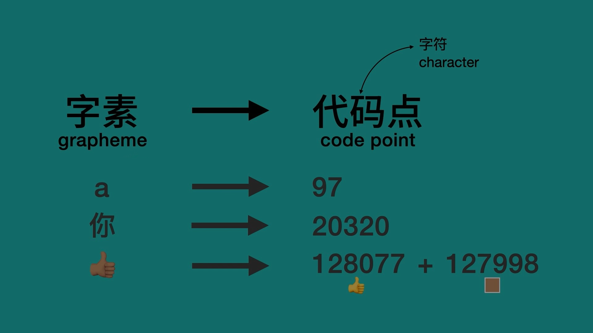
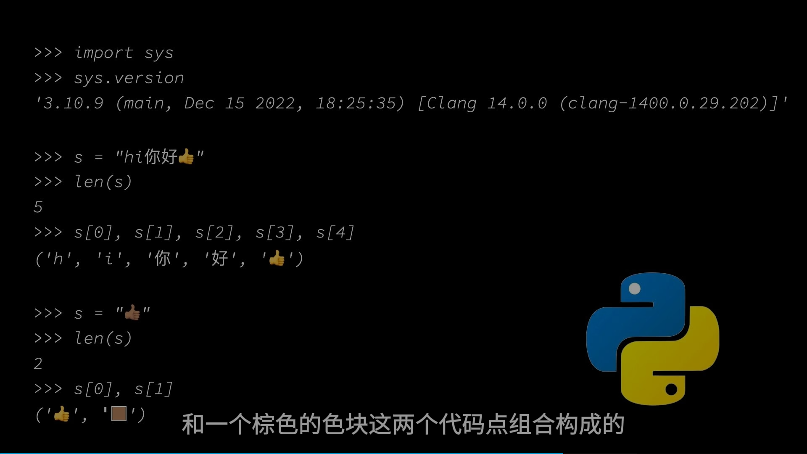
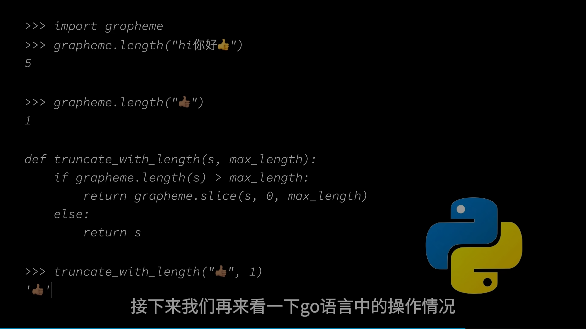
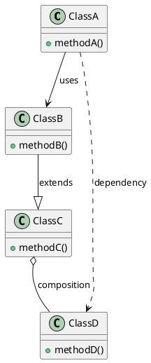

# 1. 核心

## 1.1. GOF 设计模式

• 历史性著作《设计模式：可复用面向对象软
件的基础》一书中描述了23种经典面向对象
设计模式，创立了模式在软件设计中的地位。

• 由于《设计模式》一书确定了设计模式的地
位，通常所说的设计模式隐含地表示“面向
对象设计模式”。但这并不意味“设计模式”
就等于“面向对象设计模式”。

例如：
过程设计模式，
架构模式，
数据库模式，

## 1.2. 底层思维抽象思维

底层思维：向下，如何把握机器底层  从微观理解  对象构造

• 语言构造

• 编译转换

• 内存模型

• 运行时机制

异常处理、java垃圾收集器进行内存管理

## 1.3. 抽象思维

抽象思维：向上，如何将我们的周围世界抽象为程序代码

• 面向对象

• 组件封装

• 设计模式

• 架构模式

## 1.4. 深入理解面向对象

向下 ：深入理解三大面向对象机制

·封装，隐藏内部实现

·继承，复用现有代码

·多态，改写对象行为

向上 ：深刻把握面向对象机制所带来的抽象意义，理解如何使用
这些机制来表达现实世界，掌握什么是“好的面向对象设计”

## 1.5. 软件设计固有的复杂性

建筑商从来不会去想给一栋已建好的100层高的
楼房底下再新修一个小地下室——这样做花费
极大而且注定要失败。然而令人惊奇的是，软件
系统的用户在要求作出类似改变时却不会仔细考
虑，而且他们认为这只是需要简单编程的事。

——Object-Oriented Analysis and Design
with Applications

Grady Booch

## 1.6. 软件设计复杂的根本原因

• 客户需求的变化

• 技术平台的变化

• 开发团队的变化

• 市场环境的变化

## 1.7. GOF-23 模式分类

### 1.7.1. 从目的来看

·创建型（ Creational ）模式：将对象的部分   创建工作  延迟到子
类或者其他对象 ，从而应对需求变化为对象创建时具体类型实
现引|来的冲击。

· 结构型（ Structural ）模式：通过类继承或者对象组合获得更灵
活的结构，从而应对   需求变化   为对象的结构带来的冲击。

·行为型（ Behavioral ）模式：通过类继承或者对象组合来划分
类与对象间的职责，从而应对需求变化为多个   交互   的对象带来
的冲击。

### 1.7.2. 从范围来看

·类模式处理类与子类的静态关系。

·对象模式处理对象间的动态关系。

## 1.8. 重构获得模式 Refactoring to Patterns

设计模式的应用不宜先入为主，一上来就使用设计模式是对设计
模式的最大误用。没有一步到位的设计模式。   敏捷软件开发   实践提
倡的“Refactoring to Patterns”是目前普遍公认的最好的使用设
计模式的方法。

## 1.9. 重构关键技法

从不同角度看待同一个问题

------
静态            动态

早绑定          晚绑定

编译时依赖      运行时依赖

------
继承            组合

紧耦合          松耦合

这五种重构设计的对比可以从不同的角度看待同一个问题，主要体现在
如何组织和管理
    代码结构、
    依赖关系 以及
    灵活性。
下面是对每一对的详细解释：

### 1.9.1. 静态 vs 动态

- **静态**：
  - 在编译时确定类型和关系，
  - 通常意味着较高的性能和安全性，
  - 但灵活性较低。
- **动态**：
  - 在运行时决定类型和关系，
  - 提供更大的灵活性和可扩展性，
  - 但可能带来性能开销。

### 1.9.2. 早绑定 vs 晚绑定

- **早绑定**：
  - 在编译时确定方法的调用，
  - 通常通过静态类型检查实现，
  - 能够提供更好的性能和类型安全。
- **晚绑定**：
  - 在运行时确定方法的调用，
  - 使用多态（如虚函数），
  - 可以提高灵活性和可扩展性，
  - 但可能导致性能下降。

### 1.9.3. 继承 vs 组合

- **继承**：
  - 通过子类化父类来实现代码重用，
  - 建立了“是一个”的关系，
  - 有助于构建层次结构，
  - 但容易导致紧耦合和不灵活。
- **组合**：
  - 通过将对象组合在一起以实现功能，
  - 建立了“有一个”的关系，
  - 更加灵活，
  - 有助于实现松耦合，
  - 便于维护和扩展。

### 1.9.4. 编译时依赖 vs 运行时依赖

- **编译时依赖**：
  - 在编译过程中确定依赖关系，
  - 通常意味着更高的效率和安全性，
  - 但难以适应变化。
- **运行时依赖**：在
  - 运行时确定依赖关系，
  - 可以实现更大的灵活性和动态性，
  - 适应变化的能力强，
  - 但可能导致潜在的错误和性能问题。

### 1.9.5. 紧耦合 vs 松耦合

- **紧耦合**：
  - 组件之间的依赖关系很强，
  - 相互之间高度依赖，
  - 修改一个组件可能引发其他组件的变化，
  - 维护困难。
- **松耦合**：
  - 组件之间的依赖关系较弱，
  - 各自独立，
  - 修改一个组件时对其他组件的影响较小，
  - 有利于系统的扩展和维护。

### 1.9.6. 总结

这五组设计理念分别从不同的角度探讨了软件设计中的重要问题，如
    灵活性、
    性能、
    安全性、
    可维护性和
    可扩展性
。理解和权衡这些不同的设计思路可以帮助开发者制定更合适的解决方案，以适应具体的应用场景和需求。

## 1.10. 动态、晚绑定和运行时依赖

动态、晚绑定和运行时依赖的特性确实可能导致性能下降，主要原因包括以下几点：

### 1.10.1. 运行时类型检查

- **描述**：
  - 在动态和晚绑定中，
  - 系统需要在运行时进行类型检查，
  - 以确定对象的真实类型。
  - 这会增加额外的开销。
- **影响**：
  - 每次调用方法时，
  - 都要确定该方法的实际执行路径，
  - 尤其是在多态情况下，
  - 这会消耗 CPU 时间。

### 1.10.2. 方法查找

- **描述**：
  - 在晚绑定中，
  - 特别是使用虚函数的情况下，
  - 系统需要通过虚表（vtable）查找正确的函数地址。
- **影响**：
  - 这个查找过程比直接调用静态绑定的函数慢，
  - 因为它涉及到额外的指针解引用和查找操作。

### 1.10.3. 动态内存管理

- **描述**：
  - 运行时依赖通常需要动态分配内存，
  - 例如使用工厂模式或依赖注入时。
- **影响**：
  - 动态内存分配和管理（如分配、释放内存）比静态分配慢，
  - 并且可能导致内存碎片，
  - 从而影响性能。

### 1.10.4. 缓存局部性

- **描述**：
  - 静态绑定往往可以更好地利用 CPU 缓存，
  - 因为相关数据和代码在内存中的位置是固定的。
- **影响**：
  - 动态和运行时依赖可能导致数据和代码的访问模式不够规律，
  - 从而降低缓存命中率，
  - 导致性能下降。

### 1.10.5. 增加的复杂性

- **描述**：
  - 在动态和晚绑定的设计中，
  - 程序的控制流变得更加复杂。
- **影响**：
  - 这种复杂性可能导致优化编译器无法有效地进行某些优化，
  - 进一步影响运行效率。

### 1.10.6. 总结

虽然动态和晚绑定提供了灵活性和可扩展性，但这些特性伴随而来的性能开销在某些性能敏感的场景中可能会显著影响程序的整体表现。因此，在选择这些技术时，需要权衡灵活性与性能之间的关系。

## 1.11. 系统、组件和模块

系统、组件和模块的划分单位主要基于它们之间的通信和交互方式。以下是对这三者划分依据的详细解释：

### 1.11.1. 系统 (System)

- **通信/交互级别**：高层次交互
- **划分依据**：
  - **功能性**：系统通常是为满足特定业务需求而设计的整体解决方案，包含多个子系统（组件）。
  - **接口与协议**：系统间可能通过网络协议（如HTTP、RESTful API）或消息队列进行通信。
  - **用户交互**：系统通常直接与用户交互，提供完整的用户体验。

### 1.11.2. 组件 (Component)

- **通信/交互级别**：中层次交互
- **划分依据**：
  - **功能聚合**：组件通常封装了一组相关的功能，并通过明确的接口进行交互。组件之间的通信可以是同步的（如调用方法）或异步的（如事件驱动）。
  - **服务接口**：组件往往依赖服务接口（如API）来进行交互，以实现松耦合。
  - **数据共享**：组件之间可以通过共享数据结构或协议进行信息交换。

### 1.11.3. 模块 (Module)

- **通信/交互级别**：低层次交互
- **划分依据**：
  - **内部实现**：模块是更细粒度的功能单元，通常在同一代码库内操作，关注的是具体实现细节。
  - **函数调用**：模块之间的交互大多通过函数调用或类实例之间的直接调用实现。这种交互通常发生在内存中，性能较高。
  - **作用域与命名空间**：模块通常在一个特定的作用域内工作，通过命名空间或模块名进行区分和调用。

### 1.11.4. 总结

- **系统**：基于高层次的用户需求和跨系统的交互。
- **组件**：基于功能聚合和中层次的接口交互。
- **模块**：基于具体实现和低层次的函数调用。

这种划分有助于开发人员理解不同层级之间的关系，从而设计出更清晰、更可维护的软件架构。

## 1.12. 服务接口（API）

服务接口（API）有多种形式，主要可以根据其通信方式、数据格式和用途进行分类。以下是一些常见的API形式：

### 1.12.1. **基于协议的API**

- **RESTful API**：
  - 使用HTTP协议，以资源为中心，支持CRUD操作（创建、读取、更新、删除）。
  - 通常返回JSON或XML格式的数据。
  
- **SOAP API**：
  - 基于XML的协议，具有严格的消息格式和标准。
  - 支持复杂的操作和安全性特性（如WS-Security）。

- **GraphQL**：
  - 一种用于API的查询语言，客户端可以指定所需的数据结构，减少数据传输量。
  - 提供单个端点，允许对多个资源进行查询。

### 1.12.2. **远程过程调用 (RPC)**

- **gRPC**：
  - Google开发的高性能、开源的RPC框架，使用Protocol Buffers作为接口定义语言。
  - 支持多种语言，并且提供流式传输和双向通信。

- **JSON-RPC / XML-RPC**：
  - 简单的远程过程调用协议，允许通过JSON或XML格式发送请求和响应。

### 1.12.3. **WebSocket API**

- 提供全双工的通信通道，适合实时应用（如聊天应用、在线游戏）。
- 允许客户端与服务器之间的持续连接。

### 1.12.4. **事件驱动API**

- **Webhook**：
  - 服务器主动向客户端发送数据，通常在某些事件发生时触发（如用户注册、订单创建）。
  
- **Server-Sent Events (SSE)**：
  - 服务器通过HTTP向客户端推送实时更新，适合单向数据流。

### 1.12.5. **库和框架级API**

- **SDK（软件开发工具包）**：
  - 提供一组工具和库，帮助开发者更容易地构建应用程序，通常包括API调用的封装。

### 1.12.6. **平台特定API**

- **操作系统API**：
  - 如Windows API、Linux系统调用，提供操作系统功能的访问。

- **云服务API**：
  - 如AWS SDK、Azure REST API，提供对云服务的访问和管理。

### 1.12.7. 总结

不同类型的API适用于不同的场景和需求。选择合适的API形式可以提高系统的灵活性、可扩展性和性能。

## 1.13. 早绑定

### 1.13.1. 早绑定的优缺点

#### 1.13.1.1. 优点

1. **性能**：

- 由于在编译时已经确定了方法调用，
- 早绑定通常比晚绑定具有更高的执行效率。
- 没有运行时查找的开销。

2. **类型安全**：

- 编译时检查可以捕获类型错误，
- 提高代码的安全性和可靠性。
- 减少运行时错误的可能性。

3. **可读性**：

- 代码的控制流在编译时就已经确定，
- 使得代码更容易理解和维护。
- 开发者可以更清晰地看到方法调用的路径。

#### 1.13.1.2. 缺点

1. **灵活性**：

- 早绑定缺乏灵活性，
- 难以适应运行时的变化。
- 无法根据运行时的条件动态选择方法。

2. **扩展性**：

- 由于方法调用在编译时已经确定，
- 扩展系统功能时可能需要修改现有代码。
- 增加了维护成本。

3. **多态性**：

- 早绑定限制了多态性的使用，
- 无法充分利用面向对象编程中的多态特性。
- 影响代码的可扩展性和复用性。

### 1.13.2. 适用场景

- **性能关键的应用**：
  - 需要高性能和低延迟的场景，
  - 如实时系统、嵌入式系统。
  
- **类型安全要求高的应用**：
  - 需要在编译时捕获类型错误，
  - 提高系统的安全性和可靠性。

- **代码稳定性要求高的应用**：
  - 需要明确的控制流和方法调用路径，
  - 便于代码的维护和理解。

### 1.13.3. 总结

早绑定在性能、类型安全和代码可读性方面具有明显优势，但在灵活性和扩展性方面存在一定的局限性。开发者需要根据具体的应用场景和需求，权衡早绑定和晚绑定的优缺点，选择合适的技术方案。

早绑定：编译时确定，速度快，灵活性低。
晚绑定：运行时确定，速度慢，灵活性高。

结构化软件设计是一种强调模块化和分层的方法，旨在提高软件的可维护性、可理解性和可重用性。除了结构化软件设计，还有其他几种软件设计方法，各自有不同的特点和适用场景。以下是一些常见的软件设计方法以及它们之间的比较：

### 1.13.4. 结构化软件设计

- **特点**：
  - 强调使用模块（函数）来分解问题。
  - 采用自顶向下的设计方法，从高层次到低层次逐步细化。
  - 使用控制流图（如数据流图）表示系统的运行逻辑。
  
- **优点**：
  - 易于理解和维护。
  - 通过模块化降低复杂度。

- **缺点**：
  - 对于大型系统可能不够灵活，难以应对变化。

### 1.13.5. 面向对象设计 (OOP)

- **特点**：
  - 通过对象和类来组织代码，关注数据及其操作。
  - 强调封装、继承和多态等特性。
  
- **优点**：
  - 促进代码重用和扩展。
  - 更好地模型现实世界的对象。

- **缺点**：
  - 学习曲线相对较陡，可能导致额外的开销。

### 1.13.6. 组件化设计

- **特点**：
  - 系统被分解为独立的可重用组件，可以单独开发、测试和维护。
  - 组件之间通过定义良好的接口进行交互。
  
- **优点**：
  - 提高了系统的可维护性和可扩展性。
  - 方便团队协作，允许并行开发。

- **缺点**：
  - 设计和集成时可能需要处理接口不兼容的问题。

### 1.13.7. 服务导向架构 (SOA)

- **特点**：
  - 系统被构建为一组服务，服务之间通过网络进行通信。
  - 强调服务的独立性和重用性。
  
- **优点**：
  - 高度松耦合，易于扩展和维护。
  - 可以支持异构环境中的不同技术。

- **缺点**：
  - 网络通信引入延迟，可能影响性能。
  - 设计和管理服务的复杂性增加。

### 1.13.8. 微服务架构

- **特点**：
  - 将应用程序分解为多个小型服务，每个服务独立部署和管理。
  - 每个微服务专注于特定业务功能，通常使用不同的技术栈。
  
- **优点**：
  - 提高了敏捷性和可扩展性。
  - 方便团队独立开发和快速迭代。

- **缺点**：
  - 复杂的服务管理和数据一致性问题。
  - 需要强大的监控和调试工具。

### 1.13.9. 事件驱动架构 (EDA)

- **特点**：
  - 系统通过事件进行通信和处理，组件之间基于事件进行交互。
  - 支持异步处理和实时响应。
  
- **优点**：
  - 灵活性高，可以轻松适应变化。
  - 高度解耦，有助于实现实时系统。

- **缺点**：
  - 事件流和状态管理可能导致复杂性增加。
  - 难以调试和追踪事件流。

### 1.13.10. 总结

不同的软件设计方法具有各自的优缺点，适用于不同类型的项目和需求。选择合理的方法取决于项目规模、团队结构、技术栈以及业务需求等因素。结构化软件设计适合较简单和小型项目，而面向对象设计和微服务架构更适合复杂和大型系统的开发。

##  1.14. 注入

依赖注入（Dependency Injection, DI）是一种软件设计模式，它通过将对象的依赖关系从类内部转移到外部来提高代码的灵活性和可测试性。以下是几种常见的依赖注入方式，并附有示例代码。

### 1.14.1. 构造函数注入

使用构造函数将依赖项作为参数传递给类。

```cpp
#include <iostream>

// 依赖接口
class IService {
public:
    virtual void execute() = 0;
};

// 具体实现
class ServiceA : public IService {
public:
    void execute() override {
        std::cout << "ServiceA executed!" << std::endl;
    }
};

// 客户类，依赖于 IService
class Client {
private:
    IService* service;
public:
    Client(IService* svc) : service(svc) {} // 构造函数注入

    void doWork() {
        service->execute();
    }
};

int main() {
    ServiceA serviceA;
    Client client(&serviceA);
    client.doWork(); // 输出: ServiceA executed!
    return 0;
}
```

### 1.14.2. Setter 注入

使用 setter 方法来设置依赖项。

```cpp
class Client {
private:
    IService* service;
public:
    void setService(IService* svc) { // Setter 注入
        service = svc;
    }

    void doWork() {
        if (service) {
            service->execute();
        }
    }
};

int main() {
    ServiceA serviceA;
    Client client;
    client.setService(&serviceA); // 通过 setter 设置依赖
    client.doWork(); // 输出: ServiceA executed!
    return 0;
}
```

### 1.14.3. 接口注入

通过定义一个接口来注入依赖项。

```cpp
class IInjectable {
public:
    virtual void inject(IService* svc) = 0;
};

class Client : public IInjectable {
private:
    IService* service;
public:
    void inject(IService* svc) override { // 接口注入
        service = svc;
    }

    void doWork() {
        if (service) {
            service->execute();
        }
    }
};

int main() {
    ServiceA serviceA;
    Client client;
    client.inject(&serviceA); // 通过接口注入依赖
    client.doWork(); // 输出: ServiceA executed!
    return 0;
}
```

### 1.14.4. 使用容器（如 Google Guice 或 Spring）

在大型项目中，可以使用依赖注入容器来管理依赖关系。这种方法通常会涉及到更多的配置，但可以显著减少手动管理依赖的复杂性。

#### 1.14.4.1. 示例（伪代码）：

```cpp
// 伪代码表示容器的使用
class DependencyInjector {
public:
    IService* getService() {
        return new ServiceA(); // 返回具体服务实例
    }

    Client* createClient() {
        return new Client(getService()); // 自动注入依赖
    }
};

int main() {
    DependencyInjector di;
    Client* client = di.createClient();
    client->doWork(); // 输出: ServiceA executed!
    
    delete client; // 记得清理内存
    return 0;
}
```

### 1.14.5. 小结

依赖注入有助于解耦代码，提高模块化和可测试性。选择合适的依赖注入方式取决于你的应用程序规模、复杂性、团队的熟悉程度等因素。在小型项目中，简单的构造函数或 setter 注入通常就足够了，而在大型项目中，使用容器可能更为方便。

## 1.15. virtual override

在 C++ 中，关于 `override` 关键字的使用及其与虚函数（`virtual`）的关系，下面是一些重要的概念：

### 1.15.1. 虚函数和纯虚函数

- **虚函数**：在基类中声明为 `virtual` 的函数，可以在派生类中被重写。即使没有使用 `override` 关键字，派生类中的函数仍然会被视为对基类虚函数的重写。

- **纯虚函数**：在基类中声明为 `virtual` 并赋值为 0 的函数，表示该函数没有实现，必须在派生类中实现。此时，派生类实现这个函数时，使用 `override` 是推荐的做法，但不是强制的。

### 1.15.2. `override` 的作用

- **可读性**：使用 `override` 可以清楚地表明这个函数是重写父类的虚函数，增加代码的可读性。

- **编译器检查**：如果你在派生类中声明了一个函数，并且使用了 `override`，编译器会检查这个函数是否确实重写了基类中的虚函数。如果没有匹配的虚函数，编译器会报错。这可以帮助捕捉到因函数签名不匹配而导致的错误。

### 1.15.3. 使用 `virtual` 关键字

- 在派生类中，可以选择性地使用 `virtual` 关键字。虽然可以在派生类中再次声明为 `virtual`，但这没有必要，因为它已经隐含了虚函数的特性。

- 一般来说，除非需要重新定义该函数为虚函数（通常不需要），否则只需实现该函数即可。

### 1.15.4. 示例代码

```cpp
#include <iostream>

class Base {
public:
    virtual void show() { // 虚函数
        std::cout << "Base show" << std::endl;
    }

    virtual void pureShow() = 0; // 纯虚函数
};

class Derived : public Base {
public:
    void show() override { // 使用 override 推荐
        std::cout << "Derived show" << std::endl;
    }

    void pureShow() override { // 纯虚函数的实现
        std::cout << "Derived pureShow" << std::endl;
    }
};

int main() {
    Derived d;
    d.show();      // 输出: Derived show
    d.pureShow();  // 输出: Derived pureShow
    return 0;
}
```

### 1.15.5. 总结

- 使用 `override` 不仅是良好的编码习惯，还有助于提高代码安全性。
- 在派生类中可以省略 `virtual`，因为虚函数的特性已经由基类继承。
- 强烈建议在重写基类虚函数时使用 `override`，以避免潜在的错误。

## 1.16. 多继承

一个主的继承类，其他都是接口（或者是抽象基类|接口）


## 1.17. 先 声明 ， 后 使用

在 C++ 中，确实需要先声明后使用，具体来说，有以下几个要点：

### 1.17.1. 函数声明

- **函数声明**：如果你想在某个函数中调用另一个函数，该函数必须在调用之前被声明。可以通过函数原型进行声明。例如：

```cpp
#include <iostream>

void myFunction(); // 函数声明

int main() {
    myFunction(); // 调用 myFunction
    return 0;
}

void myFunction() { // 函数定义
    std::cout << "Hello, World!" << std::endl;
}
```

### 1.17.2. 类和成员函数

- 对于类中的成员函数，也需要在使用之前进行声明。这可以通过类的定义来实现。

```cpp
#include <iostream>

class MyClass {
public:
    void myMethod(); // 成员函数声明
};

void MyClass::myMethod() { // 成员函数定义
    std::cout << "MyClass method called." << std::endl;
}

int main() {
    MyClass obj;
    obj.myMethod(); // 调用 myMethod
    return 0;
}
```

### 1.17.3. 作用域和链式调用

- 如果你在一个函数内部定义了另一个函数，必须在调用之前完成该函数的定义或声明。

### 1.17.4. 前向声明

- 在某些情况下，可以使用前向声明（forward declaration）来解决循环依赖的问题，尤其是在涉及到类之间的引用时。

```cpp
class B; // 前向声明

class A {
public:
    void doSomething(B* b); // 使用 B 的指针，但没有完整定义 B
};

class B {
public:
    void doSomething() {}
};
```

### 1.17.5. 总结

- **先声明后使用**：在 C++ 中，必须先声明（或定义）函数/类/变量，然后才能在代码中使用它们。
- **前向声明**：可以用来解决某些依赖关系，但仍需在使用前确保相关类型已被声明。

这使得编译器能够理解每个标识符的含义，从而避免未定义行为和编译错误。

## 1.18. 循环引用

在 C++ 和 Python 中，循环引用的概念和处理方式是不同的，但并不能简单地说 Python 不支持循环引用，而是它们对循环引用的管理方式有显著的区别。

### 1.18.1. C++ 中的循环引用

- **C++**：在 C++ 中，你可以创建循环引用（例如，通过使用指针或智能指针）。但是需要注意的是，如果使用原始指针，可能会导致内存泄漏，因为两个对象可能会相互持有对方的引用。使用智能指针（如 `std::shared_ptr`）时，如果没有妥善管理，仍然可能导致循环引用的问题（特别是 `std::shared_ptr`），这通常需要使用 `std::weak_ptr` 来打破循环。

```cpp
#include <iostream>
#include <memory>

class B; // 前向声明

class A {
public:
    std::shared_ptr<B> b_ptr; // 循环引用
};

class B {
public:
    std::shared_ptr<A> a_ptr; // 循环引用
};

int main() {
    std::shared_ptr<A> a = std::make_shared<A>();
    std::shared_ptr<B> b = std::make_shared<B>();

    a->b_ptr = b;
    b->a_ptr = a; // 循环引用

    return 0; // 这里会导致内存泄漏，因为 A 和 B 相互引用
}
```

### 1.18.2. Python 中的循环引用

- **Python**：Python 支持循环引用，尤其是在使用类和对象时。例如，两个对象可以相互引用而不会引发错误。Python 的垃圾回收机制能够处理循环引用，因为它使用了引用计数和垃圾回收的结合。当没有任何对象再引用那部分内存时，循环引用的对象将被回收。

```python
class A:
    def __init__(self):
        self.b = None

class B:
    def __init__(self):
        self.a = None

a = A()
b = B()

a.b = b
b.a = a  # 循环引用

# Python 会正确处理这个情况，并且在不再需要时释放内存
```

### 1.18.3. 总结

- **循环引用**：C++ 可以创建循环引用，但是需要小心管理内存，避免内存泄漏。Python 也允许循环引用，且其垃圾回收机制能够处理这些情况。
- **内存管理**：C++ 需要手动管理内存，而 Python 则通过自动垃圾回收来处理内存。

因此，不能简单地说 Python 不支持循环引用，实际上它是支持的，但 Python 对此的处理机制要更为自动化和安全。

## 1.19. 前向声明

在 Python 中，尽管没有像 C++ 中的前向声明那样的语法，但可以通过一些方式实现类似的效果，以确保在循环引用的情况下能够正确地引用类型。

### 1.19.1. 使用字符串注解

Python 3.7 引入了 `from __future__ import annotations`，允许使用字符串来延迟类型注解。这种方式可以避免在类定义时遇到未定义的名称错误。

```python
from __future__ import annotations

class A:
    def __init__(self):
        self.b: B = None  # 使用字符串进行延迟类型注解

class B:
    def __init__(self):
        self.a: A = None  # 使用字符串进行延迟类型注解

# 示例
a = A()
b = B()

a.b = b
b.a = a  # 循环引用
```

### 1.19.2. 使用类型提示模块

在 Python 3.5 及更高版本中，可以使用 `typing` 模块中的 `TYPE_CHECKING` 来处理类型引用。这样可以避免循环导入的问题。

```python
from typing import TYPE_CHECKING

if TYPE_CHECKING:
    from b import B  # 假设 B 定义在另一个文件中

class A:
    def __init__(self):
        self.b: B  # 类型提示

# b.py 文件
class B:
    def __init__(self):
        self.a: A  # 类型提示
```

### 1.19.3. 总结

虽然 Python 没有直接的前向声明机制，但可以通过字符串注解和 `typing` 模块中的工具来实现类似的功能。这使得可以在存在循环引用的情况下保持类型安全。


## 1.20. 在不同开发层次中使用的具体技术名称

好的，以下是补全后的内容，展示了在不同开发层次中使用的具体技术名称：

```markdown
过程  回调函数（Callback Functions）
对象  抽象接口（Abstract Interfaces）
模块  模板方法模式（Template Method Pattern）
组件  依赖注入（Dependency Injection, DI）
系统  服务总线（Service Bus）
```

### 1.20.1. 具体技术名称
- **过程（Procedure）**：
  - **回调函数（Callback Functions）**：在JavaScript中，常用回调函数来处理异步操作，例如`setTimeout`、`setInterval`、事件处理等。

- **对象（Object）**：
  - **抽象接口（Abstract Interfaces）**：在Java中，使用接口（`interface`）来定义抽象接口，具体类实现这些接口。例如，`List`接口由`ArrayList`和`LinkedList`实现。

- **模块（Module）**：
  - **模板方法模式（Template Method Pattern）**：在Java中，使用抽象类和抽象方法来实现模板方法模式。例如，`java.util.AbstractList`类定义了模板方法，具体的`ArrayList`和`LinkedList`类实现具体步骤。

- **组件（Component）**：
  - **依赖注入（Dependency Injection, DI）**：在Spring框架中，使用依赖注入来管理组件之间的依赖关系。例如，通过`@Autowired`注解将依赖注入到Spring Bean中。

- **系统（System）**：
  - **服务总线（Service Bus）**：在企业级应用中，使用Azure Service Bus或Apache Kafka等服务总线来实现系统间的松耦合通信。

### 1.20.2. 示例代码
以下是一些具体技术的示例代码：

#### 1.20.2.1. 回调函数（JavaScript）
```javascript
function fetchData(callback) {
    setTimeout(() => {
        const data = "Hello, World!";
        callback(data);
    }, 1000);
}

fetchData((data) => {
    console.log(data);
});
```

#### 1.20.2.2. 抽象接口（Java）
```java
interface Animal {
    void makeSound();
}

class Dog implements Animal {
    @Override
    public void makeSound() {
        System.out.println("Woof");
    }
}

class Cat implements Animal {
    @Override
    public void makeSound() {
        System.out.println("Meow");
    }
}
```

#### 1.20.2.3. 模板方法模式（Java）
```java
abstract class DataProcessor {
    public final void process() {
        readData();
        processData();
        writeData();
    }

    protected abstract void readData();
    protected abstract void processData();
    protected abstract void writeData();
}

class CSVDataProcessor extends DataProcessor {
    @Override
    protected void readData() {
        System.out.println("Reading data from CSV file");
    }

    @Override
    protected void processData() {
        System.out.println("Processing CSV data");
    }

    @Override
    protected void writeData() {
        System.out.println("Writing data to CSV file");
    }
}
```

#### 1.20.2.4. 依赖注入（Spring）
```java
@Component
public class UserService {
    private final UserRepository userRepository;

    @Autowired
    public UserService(UserRepository userRepository) {
        this.userRepository = userRepository;
    }

    public void saveUser(User user) {
        userRepository.save(user);
    }
}
```

#### 1.20.2.5. 服务总线（Azure Service Bus）
```csharp
// Azure Service Bus 示例（C#）
string connectionString = "<your_connection_string>";
string queueName = "<your_queue_name>";

var client = new QueueClient(connectionString, queueName);

var message = new Message(Encoding.UTF8.GetBytes("Hello, World!"));
await client.SendAsync(message);

await client.CloseAsync();
```

这些示例展示了在不同开发层次中使用的具体技术名称和实现方式。


## 1.21. 详细讲解后两个

### 1.21.1. 依赖注入（Spring）

#### 1.21.1.1. 概念
依赖注入（Dependency Injection, DI）是一种设计模式，用于实现对象之间的松耦合。通过依赖注入，类不再负责创建其依赖对象，而是通过外部注入的方式获取依赖对象。Spring框架广泛使用依赖注入来管理Bean的生命周期和依赖关系。

#### 1.21.1.2. 代码示例
以下是一个简单的Spring依赖注入示例，展示了如何使用`@Autowired`注解将依赖注入到Spring Bean中：

```java
import org.springframework.beans.factory.annotation.Autowired;
import org.springframework.stereotype.Component;

// 定义一个Repository接口
interface UserRepository {
    void save(User user);
}

// 实现UserRepository接口
@Component
class UserRepositoryImpl implements UserRepository {
    @Override
    public void save(User user) {
        System.out.println("User saved: " + user.getName());
    }
}

// 定义一个User类
class User {
    private String name;

    public User(String name) {
        this.name = name;
    }

    public String getName() {
        return name;
    }
}

// 定义一个Service类，使用依赖注入
@Component
public class UserService {
    private final UserRepository userRepository;

    @Autowired
    public UserService(UserRepository userRepository) {
        this.userRepository = userRepository;
    }

    public void saveUser(User user) {
        userRepository.save(user);
    }
}

// Spring Boot应用程序入口
import org.springframework.boot.CommandLineRunner;
import org.springframework.boot.SpringApplication;
import org.springframework.boot.autoconfigure.SpringBootApplication;
import org.springframework.context.annotation.Bean;

@SpringBootApplication
public class Application {

    public static void main(String[] args) {
        SpringApplication.run(Application.class, args);
    }

    @Bean
    CommandLineRunner run(UserService userService) {
        return args -> {
            User user = new User("John Doe");
            userService.saveUser(user);
        };
    }
}
```

在这个示例中：
- `UserRepository`接口定义了一个保存用户的方法。
- `UserRepositoryImpl`类实现了`UserRepository`接口，并使用`@Component`注解将其声明为Spring Bean。
- `UserService`类使用`@Autowired`注解将`UserRepository`注入到其构造函数中。
- `Application`类是Spring Boot应用程序的入口，通过`CommandLineRunner`接口在应用启动时执行代码。

### 1.21.2. 服务总线（Azure Service Bus）

#### 1.21.2.1. 概念
服务总线（Service Bus）是一种消息传递中间件，用于在分布式系统中实现松耦合的通信。Azure Service Bus是微软Azure平台提供的一种消息传递服务，支持队列和发布/订阅模式，适用于跨应用程序和服务之间的异步通信。

#### 1.21.2.2. 代码示例
以下是一个简单的Azure Service Bus示例，展示了如何发送和接收消息：

```csharp
using System;
using System.Text;
using System.Threading.Tasks;
using Microsoft.Azure.ServiceBus;

class Program
{
    const string ServiceBusConnectionString = "<your_connection_string>";
    const string QueueName = "<your_queue_name>";
    static IQueueClient queueClient;

    static async Task Main(string[] args)
    {
        queueClient = new QueueClient(ServiceBusConnectionString, QueueName);

        // 发送消息
        await SendMessagesAsync();

        // 接收消息
        RegisterOnMessageHandlerAndReceiveMessages();

        Console.WriteLine("Press ENTER to exit.");
        Console.ReadLine();

        await queueClient.CloseAsync();
    }

    static async Task SendMessagesAsync()
    {
        try
        {
            string messageBody = "Hello, World!";
            var message = new Message(Encoding.UTF8.GetBytes(messageBody));
            Console.WriteLine($"Sending message: {messageBody}");
            await queueClient.SendAsync(message);
        }
        catch (Exception exception)
        {
            Console.WriteLine($"{DateTime.Now} :: Exception: {exception.Message}");
        }
    }

    static void RegisterOnMessageHandlerAndReceiveMessages()
    {
        var messageHandlerOptions = new MessageHandlerOptions(ExceptionReceivedHandler)
        {
            MaxConcurrentCalls = 1,
            AutoComplete = false
        };

        queueClient.RegisterMessageHandler(ProcessMessagesAsync, messageHandlerOptions);
    }

    static async Task ProcessMessagesAsync(Message message, CancellationToken token)
    {
        Console.WriteLine($"Received message: {Encoding.UTF8.GetString(message.Body)}");
        await queueClient.CompleteAsync(message.SystemProperties.LockToken);
    }

    static Task ExceptionReceivedHandler(ExceptionReceivedEventArgs exceptionReceivedEventArgs)
    {
        Console.WriteLine($"Message handler encountered an exception {exceptionReceivedEventArgs.Exception}.");
        return Task.CompletedTask;
    }
}
```

在这个示例中：
- `ServiceBusConnectionString`和`QueueName`是Azure Service Bus的连接字符串和队列名称。
- `queueClient`是用于与Service Bus队列交互的客户端。
- `SendMessagesAsync`方法用于发送消息到队列。
- `RegisterOnMessageHandlerAndReceiveMessages`方法注册了一个消息处理器，用于接收和处理消息。
- `ProcessMessagesAsync`方法处理接收到的消息，并将其标记为已完成。
- `ExceptionReceivedHandler`方法处理消息处理过程中发生的异常。

通过这些示例，可以看到依赖注入和服务总线在实际应用中的具体实现方式。

## 1.22. python 后两者

当然可以，以下是Python版本的依赖注入和服务总线在实际应用中的具体实现方式。

### 1.22.1. 依赖注入（Python）

在Python中，可以使用`dependency-injector`库来实现依赖注入。以下是一个简单的示例：

#### 1.22.1.1. 安装依赖
```bash
pip install dependency-injector
```

#### 1.22.1.2. 代码示例
```python
from dependency_injector import containers, providers

# 定义一个Repository接口
class UserRepository:
    def save(self, user):
        raise NotImplementedError

# 实现UserRepository接口
class UserRepositoryImpl(UserRepository):
    def save(self, user):
        print(f"User saved: {user.name}")

# 定义一个User类
class User:
    def __init__(self, name):
        self.name = name

# 定义一个Service类，使用依赖注入
class UserService:
    def __init__(self, user_repository: UserRepository):
        self.user_repository = user_repository

    def save_user(self, user: User):
        self.user_repository.save(user)

# 定义一个容器来管理依赖关系
class Container(containers.DeclarativeContainer):
    user_repository = providers.Singleton(UserRepositoryImpl)
    user_service = providers.Factory(UserService, user_repository=user_repository)

# 使用示例
if __name__ == "__main__":
    container = Container()
    user_service = container.user_service()

    user = User("John Doe")
    user_service.save_user(user)
```

在这个示例中：
- `UserRepository`是一个接口，`UserRepositoryImpl`是其实现。
- `UserService`类通过构造函数注入`UserRepository`。
- `Container`类使用`dependency-injector`库来管理依赖关系。

### 1.22.2. 服务总线（Azure Service Bus）

在Python中，可以使用`azure-servicebus`库来与Azure Service Bus进行交互。以下是一个简单的示例：

#### 1.22.2.1. 安装依赖
```bash
pip install azure-servicebus
```

#### 1.22.2.2. 代码示例
```python
import os
from azure.servicebus import ServiceBusClient, ServiceBusMessage

CONNECTION_STR = "<your_connection_string>"
QUEUE_NAME = "<your_queue_name>"

def send_message(sender):
    message = ServiceBusMessage("Hello, World!")
    sender.send_messages(message)
    print("Sent a single message")

def receive_message(receiver):
    with receiver:
        for msg in receiver:
            print("Received: " + str(msg))
            receiver.complete_message(msg)

if __name__ == "__main__":
    servicebus_client = ServiceBusClient.from_connection_string(conn_str=CONNECTION_STR, logging_enable=True)

    with servicebus_client:
        sender = servicebus_client.get_queue_sender(queue_name=QUEUE_NAME)
        send_message(sender)

        receiver = servicebus_client.get_queue_receiver(queue_name=QUEUE_NAME, max_wait_time=5)
        receive_message(receiver)
```

在这个示例中：
- `CONNECTION_STR`和`QUEUE_NAME`是Azure Service Bus的连接字符串和队列名称。
- `send_message`函数用于发送消息到队列。
- `receive_message`函数用于接收和处理消息。

通过这些示例，可以看到依赖注入和服务总线在Python中的具体实现方式。

## 1.23. 面向接口编程，依赖倒置原则，依赖注入，三者区别联系

面向接口编程、依赖倒置原则和依赖注入是软件设计中三个重要的概念。它们之间存在一定的联系，但也有各自的侧重点。以下是它们的区别和联系：

### 1.23.1. 面向接口编程

**定义**：面向接口编程是指在设计和实现系统时，优先考虑接口而非具体实现。它强调通过接口来定义对象的行为，允许不同的实现类遵循同一接口。

**特点**：
- 通过接口解耦实现和使用者，提高代码的可扩展性和维护性。
- 使得替换实现变得简单，可以在不修改客户端代码的情况下，替换不同的实现类。

**示例**：
```python
class ServiceInterface:
    def execute(self):
        pass

class ConcreteService(ServiceInterface):
    def execute(self):
        print("Executing service.")

def client_code(service: ServiceInterface):
    service.execute()

client_code(ConcreteService())
```

### 1.23.2. 依赖倒置原则 (DIP)

**定义**：依赖倒置原则是 SOLID 原则之一，要求高层模块不应依赖于低层模块，而是应依赖于抽象（接口）。同时，抽象不应依赖于细节，细节应依赖于抽象。

**特点**：
- 通过依赖抽象（接口），而不是具体实现，减少耦合。
- 使得高层模块和低层模块可以独立变化，提高系统的灵活性。

**示例**：
```python
# 高层模块
class HighLevelModule:
    def __init__(self, service: ServiceInterface):
        self.service = service

    def perform_action(self):
        self.service.execute()

# 低层模块
class LowLevelService(ServiceInterface):
    def execute(self):
        print("Low level service executed.")

high_level = HighLevelModule(LowLevelService())
high_level.perform_action()
```

### 1.23.3. 依赖注入 (DI)

**定义**：依赖注入是一种实现依赖倒置原则的技术，主要用于将依赖关系（例如服务或组件）传递给一个类，而不是在类内部创建这些依赖。这使得类不需要知道其依赖的具体实现。

**特点**：
- 提高了模块的可测试性和可维护性，因为可以轻松地替换依赖项。
- 可以通过构造函数注入、属性注入或方法注入等方式实现。

**示例**：
```python
class Client:
    def __init__(self, service: ServiceInterface):
        self.service = service

    def do_something(self):
        self.service.execute()

# 依赖注入
service = ConcreteService()
client = Client(service)
client.do_something()
```

### 1.23.4. 联系

1. **相互支持**：面向接口编程为依赖倒置原则提供了基础，因为接口的存在使得高层模块可以依赖于抽象而非具体实现。而依赖注入则是实现依赖倒置原则的一种方法。
   
2. **提高灵活性和可测试性**：三者都旨在提高系统的灵活性、可维护性和可测试性。通过面向接口编程和依赖倒置原则，可以更容易地进行单元测试，因为可以注入模拟对象。

3. **设计理念**：它们都强调解耦，而不是直接依赖具体实现，鼓励使用抽象以降低模块间的耦合度。

### 1.23.5. 总结

- **面向接口编程**：关注于通过接口定义行为，增加灵活性。
- **依赖倒置原则**：强调高层模块应依赖于抽象，而非具体实现。
- **依赖注入**：是实现依赖倒置原则的一种具体方法，通过外部提供依赖来解耦类之间的关系。


## 1.24. Python中的依赖注入框架有哪些？


在Python中，有几个流行的依赖注入框架可以帮助实现依赖注入。以下是一些常用的依赖注入框架：

1. **Dependency Injector**：
   - **简介**：一个功能强大且灵活的依赖注入框架，支持构造函数注入、属性注入和方法注入。
   - **特点**：支持配置、模块化、单例、多例等多种模式。
   - **官网**：[Dependency Injector](https://python-dependency-injector.ets-labs.org/)

2. **injector**：
   - **简介**：一个轻量级的依赖注入框架，灵感来自于Java的Guice。
   - **特点**：简单易用，支持构造函数注入和方法注入。
   - **官网**：[injector](https://injector.readthedocs.io/)

3. **python-inject**：
   - **简介**：一个简单的依赖注入框架，支持全局注入和局部注入。
   - **特点**：轻量级，易于集成。
   - **官网**：[python-inject](https://github.com/ivankorobkov/python-inject)

4. **Pony DI**：
   - **简介**：一个轻量级的依赖注入框架，支持构造函数注入和属性注入。
   - **特点**：简单易用，适合小型项目。
   - **官网**：[Pony DI](https://github.com/ponyorm/pony-di)

### 1.24.1. 示例代码

#### 1.24.1.1. Dependency Injector 示例
```python
from dependency_injector import containers, providers

class UserRepository:
    def save(self, user):
        print(f"User saved: {user.name}")

class UserService:
    def __init__(self, user_repository: UserRepository):
        self.user_repository = user_repository

    def save_user(self, user):
        self.user_repository.save(user)

class User:
    def __init__(self, name):
        self.name = name

class Container(containers.DeclarativeContainer):
    user_repository = providers.Singleton(UserRepository)
    user_service = providers.Factory(UserService, user_repository=user_repository)

if __name__ == "__main__":
    container = Container()
    user_service = container.user_service()

    user = User("John Doe")
    user_service.save_user(user)
```

#### 1.24.1.2. injector 示例
```python
from injector import Injector, inject, singleton

class UserRepository:
    def save(self, user):
        print(f"User saved: {user.name}")

@singleton
class UserService:
    @inject
    def __init__(self, user_repository: UserRepository):
        self.user_repository = user_repository

    def save_user(self, user):
        self.user_repository.save(user)

class User:
    def __init__(self, name):
        self.name = name

if __name__ == "__main__":
    injector = Injector()
    user_service = injector.get

(User

Service)

    user = User("John Doe")
    user_service.save_user(user)
```

这些示例展示了如何使用不同的依赖注入框架来管理依赖关系。选择合适的框架取决于项目的具体需求和复杂度。

## 1.25. Python中的服务定位器模式是什么？

服务定位器模式（Service Locator Pattern）是一种设计模式，用于在运行时动态查找和获取服务实例。它提供了一种集中管理服务实例的方式，避免了直接依赖具体的服务实现，从而实现了松耦合。

### 1.25.1. 服务定位器模式的实现
服务定位器模式通常包括以下几个部分：
1. **服务接口**：定义服务的接口。
2. **服务实现**：实现服务接口的具体类。
3. **服务定位器**：负责注册和查找服务实例的类。

### 1.25.2. 示例代码
以下是一个简单的Python示例，展示了如何实现服务定位器模式：

```python
# 定义服务接口
class UserRepository:
    def save(self, user):
        raise NotImplementedError

# 实现服务接口
class UserRepositoryImpl(UserRepository):
    def save(self, user):
        print(f"User saved: {user.name}")

# 定义服务定位器
class ServiceLocator:
    _services = {}

    @classmethod
    def register_service(cls, service_name, service_instance):
        cls._services[service_name] = service_instance

    @classmethod
    def get_service(cls, service_name):
        service_instance = cls._services.get(service_name)
        if not service_instance:
            raise ValueError(f"Service {service_name} not found")
        return service_instance

# 定义一个User类
class User:
    def __init__(self, name):
        self.name = name

# 使用示例
if __name__ == "__main__":
    # 注册服务
    user_repository = UserRepositoryImpl()
    ServiceLocator.register_service("UserRepository", user_repository)

    # 获取服务
    user_repository = ServiceLocator.get_service("UserRepository")

    # 使用服务
    user =

 User

("John Doe")
    user_repository.save(user)
```

在这个示例中：
- [`UserRepository`](command:_github.copilot.openSymbolFromReferences?%5B%22%22%2C%5B%7B%22uri%22%3A%7B%22scheme%22%3A%22file%22%2C%22authority%22%3A%22%22%2C%22path%22%3A%22%2FF%3A%2FEdata%2Fprogram_language%2Fgit_ln%2Fdesign-patterns-cpp%2Fzyt%E9%87%8D%E6%9E%84.md%22%2C%22query%22%3A%22%22%2C%22fragment%22%3A%22%22%7D%2C%22pos%22%3A%7B%22line%22%3A1478%2C%22character%22%3A40%7D%7D%5D%2C%224efb734b-6f55-40de-8a39-853a2e7feddf%22%5D "Go to definition")是一个服务接口，`UserRepositoryImpl`是其实现。
- `ServiceLocator`类负责注册和查找服务实例。
- 在`main`函数中，首先注册服务实例，然后通过服务定位器获取服务实例并使用它。

### 1.25.3. 服务定位器模式的优缺点
#### 1.25.3.1. 优点：
- **松耦合**：客户端代码不需要直接依赖具体的服务实现，只需依赖服务接口。
- **集中管理**：服务实例的创建和管理集中在服务定位器中，便于维护和修改。

#### 1.25.3.2. 缺点：
- **隐藏依赖**：服务定位器模式可能会隐藏类的依赖关系，使代码难以理解和维护。
- **全局状态**：服务定位器通常使用全局状态来存储服务实例，这可能导致难以测试和调试。

服务定位器模式在某些情况下非常有用，但在使用时需要权衡其优缺点，并根据具体需求选择合适的设计模式。


## 1.26. 控制反转、依赖注入、依赖倒置原则三者区别

控制反转（Inversion of Control）、依赖注入（Dependency Injection）和依赖倒置原则（Dependency Inversion Principle）是软件设计中的重要概念，虽然它们相互关联，但各自有不同的重点和应用。以下是它们的区别：

### 1.26.1. 控制反转 (IoC)

**定义**：控制反转是一种设计原则，指的是将对象的控制权从程序代码转移到框架或容器。这意味着对象不再直接创建其依赖，而是由外部系统负责管理这些依赖。

**特点**：
- 通过将对象的生命周期管理交给外部容器（如 Spring），实现解耦。
- 使得应用程序的结构更加灵活，有助于增强可测试性。

**示例**：
在一个使用 IoC 的框架中，通常配置好依赖关系，然后框架在运行时自动实例化和注入依赖对象。

### 1.26.2. 依赖注入 (DI)

**定义**：依赖注入是实现控制反转的一种具体技术，通过将依赖关系（对象或服务）传递给一个类，而不是在类内部创建这些依赖，从而降低耦合度。

**特点**：
- 可以通过构造函数、属性或方法等多种方式注入依赖。
- 有助于提高代码的可测试性和可维护性，因为可以轻松替换依赖项。

**示例**：
```python
class Service:
    def execute(self):
        print("Service executed.")

class Client:
    def __init__(self, service: Service):
        self.service = service

# 依赖注入
service_instance = Service()
client_instance = Client(service_instance)
```

### 1.26.3. 依赖倒置原则 (DIP)

**定义**：依赖倒置原则是 SOLID 原则之一，强调高层模块应依赖于抽象（接口），而非具体实现，同时抽象不应依赖于细节，细节应依赖于抽象。

**特点**：
- 通过依赖抽象而不是具体类，从根本上减少模块间的耦合。
- 使得高层和低层模块可以独立变化，增强系统的灵活性和可扩展性。

**示例**：
```python
class ServiceInterface:
    def execute(self):
        pass

class LowLevelService(ServiceInterface):
    def execute(self):
        print("Low level service executed.")

class HighLevelModule:
    def __init__(self, service: ServiceInterface):
        self.service = service

# 使用依赖倒置原则
service_instance = LowLevelService()
high_level_instance = HighLevelModule(service_instance)
```

### 1.26.4. 总结

- **控制反转（IoC）**：是一种设计思想，涉及将对象的控制权交给外部容器或框架。
- **依赖注入（DI）**：是控制反转的一种具体实现方式，通过外部提供依赖来解耦类之间的关系。
- **依赖倒置原则（DIP）**：是设计原则，强调高层模块应依赖于抽象而非具体实现，以降低耦合度。

这三者共同促进了软件系统的灵活性、可维护性和可测试性，但它们的关注点和实现方式有所不同。


IoC 是 "Inversion of Control" 的缩写，翻译为“控制反转”。这是一个软件设计原则，用于增强程序的灵活性和可维护性。

## 1.27. 结构化VS. 面向对象

结构化编程和面向对象编程是两种不同的编程范式，各自有其特点与适用场景。以下是这两者的比较：

### 1.27.1. 结构化编程 (Structured Programming)

#### 1.27.1.1. 特点：
- **重视过程**：结构化编程强调过程和函数，通过将程序分解为小的、可管理的模块（函数）来实现。
- **控制结构**：使用条件语句（如 if、switch）、循环（如 for、while）等控制结构来控制程序的执行流程。
- **数据和功能分离**：数据处理与数据本身相对独立，数据通常以结构体或数组等形式存在。
- **可读性和维护性**：通过模块化来提高代码的可读性和可维护性。

#### 1.27.1.2. 优点：
- 逻辑清晰，容易理解。
- 适合较小规模的项目。
- 易于调试和测试。

#### 1.27.1.3. 缺点：
- 难以应对复杂系统：随着系统的增大，代码的管理和组织变得困难。
- 不够灵活：难以重用代码和扩展。

### 1.27.2. 面向对象编程 (Object-Oriented Programming, OOP)

#### 1.27.2.1. 特点：
- **重视对象**：OOP 将数据和操作这些数据的函数封装在一起，形成对象。
- **封装**：通过封装隐藏对象内部的实现细节，只暴露必要的接口。
- **继承**：允许创建新类（子类）以复用、扩展或修改现有类（父类）的行为。
- **多态**：允许不同对象以相同的方式响应相同的消息，提高了程序的灵活性。

#### 1.27.2.2. 优点：
- 适合大型、复杂系统的开发。
- 代码复用性高：通过继承和组合，可以重用已有的类。
- 易于扩展和维护：新功能可以通过添加新类而不是修改现有代码实现。

#### 1.27.2.3. 缺点：
- 学习曲线陡峭：对于初学者来说，理解OOP的概念可能比较困难。
- 可能引入额外的复杂性：在一些简单的场景中，OOP 可能显得过于复杂。

### 1.27.3. 总结

- **适用场景**：
  - 结构化编程更适合较小的、简单的程序，强调整体的顺序和逻辑。
  - 面向对象编程则更适合复杂的应用程序，强调重用和模块化。

- **实现思想**：
  - 结构化编程关注的是“做什么”，即过程。
  - 面向对象编程关注的是“是什么”，即对象及其交互。

选择哪种编程范式通常取决于项目的需求、规模以及团队的熟悉程度。在实际开发中，很多语言和项目会结合这两种方法的优点。


## 1.28. ASCII、Unicode和UTF-8编码

https://www.bilibili.com/video/BV14Ns8eEERu/?spm_id_from=333.1007.tianma.1-1-1.click&vd_source=15af266292056c5d92fb6aa45ac9c1d0

**字素** 可以包括两 **代码点**
字素 才是最小单位


python 使用的是 代码点



## 1.29. 中断器

### 1.29.1. 解释与总结

**中断器 (Interceptors)** 是一种软件结构，能够中断正常的控制流，允许其他代码运行。它在基于对象的分布式系统中非常有用，能够实现对象中间件的功能，支持远程对象调用。具体过程如下：

1. **本地接口调用**：本地应用程序中的对象 A 提供一个接口，该接口与另一台机器上的对象 B 提供的接口完全相同。A 只需要调用该接口中的一个方法变量即可。
2. **中断与激活**：A 的调用被中断器中断，转换为一个通用的对象激活。这可以通过与 A 在同一台机器上的中间件所提供的对象激活接口来完成。
3. **消息传输**：该通用对象激活再被中断转换为一个系统级消息，该消息可以通过 A 的本地操作系统所提供的传输层网络接口来完成。

这种机制隐藏了 A 和 B 对象实际是分布存储的事实，实现了远程对象调用。中断器作为底层组件，实现了接口调用的映射，提供了中间件的机制。

### 1.29.2. 目前可以使用的技术框架

以下是一些支持中断器和远程对象调用的技术框架：

1. **Java RMI (Remote Method Invocation)**：
   - Java RMI 是 Java 提供的一种机制，允许在不同 JVM 上运行的对象相互调用方法。
   - 适用于基于 Java 的分布式系统。

2. **Spring AOP (Aspect-Oriented Programming)**：
   - Spring AOP 提供了拦截器的实现，可以在方法调用前后执行额外的逻辑。
   - 适用于基于 Spring 框架的应用程序。

3. **Apache Thrift**：
   - Thrift 是一个跨语言的 RPC 框架，支持多种编程语言。
   - 适用于需要跨语言通信的分布式系统。

4. **gRPC**：
   - gRPC 是一个高性能的 RPC 框架，基于 HTTP/2 协议，支持多种编程语言。
   - 适用于需要高性能和多语言支持的分布式系统。

5. **.NET Remoting**：
   - .NET Remoting 是 .NET 框架提供的一种机制，允许在不同应用程序域之间进行远程对象调用。
   - 适用于基于 .NET 的分布式系统。

这些框架都提供了类似中断器的机制，能够实现远程对象调用和分布式系统的功能。选择具体框架时，可以根据项目的编程语言、性能需求和系统架构来决定。

## 1.30. OS 架构

https://cloud.tencent.com/developer/article/2145551


---
created: 2024-10-05T15:13:06 (UTC +08:00)
tags: [abstraction,hierarchy,操作系统,模块化]
source: https://cloud.tencent.com/developer/article/2145551
1.31. author: 
---

> 即模块化(modularity)、抽象（abstraction)、分层(layering)和层级(hierarchy)

---
### 1.31.1. 操作系统的设计目标

操作系统的设计目标可以分为两种：

1、用户目标：方便使用、容易学习、可靠、安全以及流畅等

2、系统目标：易于实现与维护、灵活，可靠、不易出错、高效等。

### 1.31.2. 操作系统的机制与策略

如何有效控制操作系统的复杂度？这里有一个很重要的设计原则：**将策略与机制相分离**

策略表示“要做什么”，机制表示“该如何做”

### 1.31.3. 管理复杂系统的重要方法：M.A.L.H

即模块化(modularity)、抽象（abstraction)、分层(layering)和层级(hierarchy)

**模块化：**划分模块，分而治之。需要充分考虑高内聚和低耦合

**抽象：**在模块化的基础上，**将接口与内部实现分离。**

**宽进严出原则**

一个模块的接口应当容忍各种可能的输入，一直错误甚至恶意的输入，避免错误或而已输入的效果在模块内传播，并且尽可能地控制模块对外的输出，从而减少错误在模块之间的传播。

**分层：**一个模块只能和同层模块以及相邻的上下层模块进行交互，不能跨层交互。

**层级：**首先将一些功能相近的模块组成一个具有清晰接口的自包含子系统，然后再将这些子系统递归地组成一个具有清晰接口的更大系统。可以参考公司的组织架构

**分层是不同类模块之间的层级，而层级则是指同类模块之间的分层。**

### 1.31.4. 操作系统的内核架构


> 参考资料 《现代操作系统：原理与实现》陈海波 夏虞斌等著

**转载请注明来源：**[**https://www.longjin666.top/?p=1162**](https://cloud.tencent.com/developer/tools/blog-entry?target=https%3A%2F%2Fwww.longjin666.top%2F%3Fp%3D1162&source=article&objectId=2145551)

本文参与 [腾讯云自媒体同步曝光计划](https://cloud.tencent.com/developer/support-plan)，分享自作者个人站点/博客。

原始发表：2021年9月6日20，

如有侵权请联系 [cloudcommunity@tencent.com](mailto:cloudcommunity@tencent.com) 删除

## 1.32. shell语法中，哪些是机制？哪些是策略？

在 Shell 语法中，机制和策略的分离可以通过以下方式理解：

### 1.32.1. 机制
机制是指实现 Shell 功能的**具体语法和命令**。这些包括：

1. **命令执行**：
   - `command_name`：执行具体的命令。
   - `&&`, `||`, `;`：用于控制命令的执行顺序和条件。

2. **变量管理**：
   - `VAR=value`：定义变量。
   - `echo $VAR`：访问变量的值。

3. **流程控制**：
   - `if`, `then`, `else`, `fi`：条件判断。
   - `for`, `while`, `until`：循环结构。

4. **函数定义**：
   - `function_name() { ... }`：定义和调用函数。

5. **输入输出重定向**：
   - `>`, `>>`, `<`, `|`：管理输入输出流。

### 1.32.2. 策略
策略则是指**如何使用**这些机制来实现特定的目标或行为。它涉及到高层次的决策，而不是具体的实现细节。例如：

1. **错误处理策略**：
   - 选择在某个命令失败后，是否继续执行后续命令（使用 `set -e`）。

2. **资源管理策略**：
   - 选择如何并行执行多个任务，或者如何在任务之间共享资源。

3. **环境配置策略**：
   - 决定使用哪些环境变量、路径等来影响脚本的行为。

4. **代码组织策略**：
   - 如何将功能模块化，比如选择使用函数还是直接在脚本中编写逻辑。

### 1.32.3. 总结
- **机制**是具体的语法和命令，决定“怎么做”。
- **策略**是如何组合和使用这些机制以实现特定目标，决定“做什么”。 

这种分离使得用户可以灵活地调整策略，同时依然利用 Shell 提供的各种机制。

## 1.33. C4 plantUML "Context, Containers, Components, and Code" 

C4 是 "Context, Containers, Components, and Code" 的缩写，它是一种用于软件架构建模的方法论，由 Simon Brown 提出。C4 模型旨在帮助团队更清晰地理解和描述系统的架构，尤其是在复杂的软件系统中。C4 模型分为四个层次：

1. **Context Diagram**（上下文图）：
   - 展示系统与外部实体（如用户、其他系统）的关系。

2. **Container Diagram**（容器图）：
   - 描述系统内部的主要容器（如应用程序、数据库、微服务等），以及它们之间的关系。

3. **Component Diagram**（组件图）：
   - 显示容器内部的主要组件及其交互。

4. **Code Diagram**（代码图）：
   - 更细致地展示组件内部的类和对象，以及它们的关系。

### 1.33.1. C4-PlantUML

在 Visual Studio Code 中，使用 C4-PlantUML 插件可以方便地绘制上述四个层次的 UML 图，通过简单的文本描述生成相应的可视化图形。这种方式使得架构师和开发人员能够快速迭代和更新他们的设计图。

### 1.33.2. 例子

以下是一个简单的 C4 上下文图的 PlantUML 示例：

```puml
@startuml
!include C4.puml

Person(admin, "Admin", "An administrator of the system.")
System(system, "My System", "Does awesome things.")

Rel(admin, system, "Uses")

@enduml
```

在这个示例中，我们定义了一个管理员角色和一个系统，并标明了它们之间的关系。

### 1.33.3. 总结

C4 方法提供了一种结构化的方式来描述软件系统的架构，而 C4-PlantUML 则是将这种方法通过 PlantUML 工具实现的一种方式，方便开发者在 Visual Studio Code 中创建和维护架构图。

## 1.34. DSL 是 "Domain-Specific Language"

DSL 是 "Domain-Specific Language" 的缩写，指的是一种针对特定领域或特定问题的编程语言或建模语言。与通用编程语言（如 Java、Python）不同，DSL 通常设计得更为简洁和专注，以便于解决特定领域内的任务。

### 1.34.1. DSL 的特点

1. **专用性**：
   - DSL 针对特定领域的需求进行优化，提供相关的语法和功能，使得开发人员可以更高效地表达概念。

2. **易读性**：
   - DSL 通常采用接近自然语言的表达方式，使得非专业人士也能理解和使用。

3. **简化复杂性**：
   - 通过抽象出领域内的共性，DSL 可以减少需要编写的代码量，从而降低复杂性。

### 1.34.2. C4 DSL

在上下文中，C4 DSL 是用于描述 C4 模型（Context, Containers, Components, Code）的特定语言。通过这种 DSL，用户能够以简单的文本格式定义系统架构，并使用工具（如 PlantUML）将其转换为可视化图形。

### 1.34.3. 示例

以下是 C4 DSL 的一个简单示例，用于描述一个系统的上下文：

```plaintext
Person(admin, "Admin", "An administrator of the system.")
System(system, "My System", "Does awesome things.")
Rel(admin, system, "Uses")
```

这个 DSL 描述了一个管理员和系统之间的关系，非常直观且易于理解。

### 1.34.4. 总结

DSL 提供了一种高效的方式来处理特定领域的问题，而 C4 DSL 则是针对软件架构设计而创建的，帮助团队更好地沟通和记录他们的系统架构。


## 1.35. 类图关系

当然可以！以下是一个使用 PlantUML 描述 UML 类图中类与类之间关系的示例代码，以及生成的图像说明。

### 1.35.1. PlantUML 代码示例



### 1.35.2. UML 类图关系说明

1. **`uses`（依赖关系）**：
   - 表示一个类使用另一个类，但不拥有它。例如：`ClassA` 使用 `ClassB`。

2. **`extends`（继承关系）**：
   - 表示一个类继承自另一个类。这里 `ClassB` 继承自 `ClassC`。

3. **`composition`（组合关系）**：
   - 表示一个类完全拥有另一个类的生命周期。这里 `ClassC` 组合了 `ClassD`。

4. **`dependency`（依赖关系）**：
   - 表示一个类依赖于另一个类，即一个类的变更可能影响另一个类。这里 `ClassA` 依赖于 `ClassD`。

### 1.35.3. 生成的图像

你可以使用 PlantUML 工具来生成上述代码对应的 UML 类图。只需将代码粘贴到支持 PlantUML 的工具中，例如在线 PlantUML 编辑器，便能生成相应的图像。

这样就完整展示了 UML 中类与类之间的各种关系，并标注了关系的名字。希望这对你有帮助！


## 1.36. 除了面向对象，还有什么其他的手法？将所要创建的具体对象工作延迟到子类， 从而实现一种扩展 （而非更改） 的策略， 较好地解决了这种紧耦合关系。

除了面向对象的方式外，Factory Method模式可以通过以下几种其他手法来实现对象创建与扩展：

### 1.36.1. **函数式编程**
在函数式编程中，可以使用高阶函数来创建对象。这些函数可以接收其他函数作为参数，从而实现延迟创建和扩展。

```javascript
// JavaScript 示例
const createObject = (type) => {
    const factories = {
        car: () => ({ type: 'Car', wheels: 4 }),
        bike: () => ({ type: 'Bike', wheels: 2 }),
    };
    return factories[type] ? factories[type]() : null;
};

const myCar = createObject('car');
const myBike = createObject('bike');
```

### 1.36.2. **配置模式（Configuration Pattern）**
通过使用配置文件或参数来决定创建哪个具体对象。这种方式可以使对象的创建逻辑与业务逻辑分离。

```yaml
# config.yaml
vehicles:
  - type: car
  - type: bike
```

```python
import yaml

with open("config.yaml", 'r') as file:
    config = yaml.safe_load(file)

for vehicle in config['vehicles']:
    if vehicle['type'] == 'car':
        # 创建 Car 对象
    elif vehicle['type'] == 'bike':
        # 创建 Bike 对象
```

### 1.36.3. **服务定位器模式（Service Locator Pattern）**
使用一个中央注册表来查找和创建对象。客户端请求对象时，不需要知道具体的实现类。

```java
public class ServiceLocator {
    private static final Map<String, Service> services = new HashMap<>();

    public static void registerService(String name, Service service) {
        services.put(name, service);
    }

    public static Service getService(String name) {
        return services.get(name);
    }
}
```

### 1.36.4. **原型模式（Prototype Pattern）**
通过克隆现有的对象来创建新对象。这种方式使得对象的创建不依赖于具体的类。

```java
public class Prototype implements Cloneable {
    @Override
    protected Object clone() throws CloneNotSupportedException {
        return super.clone();
    }
}

// 使用原型创建新对象
Prototype prototype = new Prototype();
Prototype newObject = (Prototype) prototype.clone();
```

### 1.36.5. **枚举类型（Enum）**
在某些语言中，可以使用枚举来定义固定的一组实例，并通过枚举值来创建对象。

```java
public enum VehicleType {
    CAR, BIKE;

    public Vehicle create() {
        switch (this) {
            case CAR: return new Car();
            case BIKE: return new Bike();
            default: throw new IllegalArgumentException();
        }
    }
}

// 使用枚举创建对象
Vehicle myCar = VehicleType.CAR.create();
```

### 1.36.6. 总结
除了面向对象的方法，使用函数式编程、配置模式、服务定位器模式、原型模式和枚举类型等手法也能有效地实现对象的延迟创建和扩展，从而减少紧耦合关系，提高系统的灵活性和可维护性。

## 1.37. 继承 修改可见性

在继承时，可以修改父类虚函数的可见性，但有一些规则需要遵循。

### 1.37.1. 可见性修改规则

1. **可以缩小可见性**：
   - 子类可以将父类的 `public` 或 `protected` 虚函数修改为 `protected` 或 `private`。这样做会限制对该函数的访问，但仍然符合多态的原则。

2. **不可以扩大可见性**：
   - 如果父类的虚函数是 `private`，子类不能将其修改为 `protected` 或 `public`。这会违反封装原则。

### 1.37.2. 示例

```cpp
class Base {
public:
    virtual void func() {
        // ...
    }
};

class Derived : public Base {
protected:  // 修改为protected是允许的
    void func() override { 
        // ...
    }
};

// 下面的代码是错误的，因为它试图扩大可见性
class AnotherDerived : public Base {
public:  // 这里不允许将func从public扩展到public
    void func() override { 
        // ...
    }
};
```

### 1.37.3. 总结
可以将父类的 `public` 或 `protected` 虚函数修改为 `protected` 或 `private`，但不能将其修改为更高的可见性。因此，在设计时要谨慎考虑可见性，以确保遵循良好的面向对象原则。

## 1.38. C++ 有哪几种锁？ 区别？

在 C++ 中，主要有几种锁用于多线程编程，以确保线程安全和资源的互斥访问。以下是常见的几种锁及其区别：

### 1.38.1. **互斥锁（std::mutex）**
- **描述**：基本的互斥锁，保证同一时间只有一个线程可以访问共享资源。
- **使用场景**：适用于保护临界区，确保一个线程在访问共享资源时，其他线程无法同时访问。
- **特点**：
  - 可以通过 `lock()` 和 `unlock()` 方法来手动控制锁的获取与释放。
  - 如果一个线程已经持有锁，其他线程尝试获取该锁将会被阻塞。

### 1.38.2. **递归互斥锁（std::recursive_mutex）**
- **描述**：允许同一线程多次获取同一把锁而不会造成死锁。
- **使用场景**：适用于需要在同一线程中重复进入临界区的情况。
- **特点**：
  - 每次获取锁时需要相应的调用 `unlock()`，直到线程释放所有的锁。
  - 相较于 `std::mutex`，性能开销更大。

### 1.38.3. **共享互斥锁（std::shared_mutex）**
- **描述**：允许多个线程同时读取共享资源，但在写入时会独占资源。
- **使用场景**：适合读多写少的场景，可以提高并发性。
- **特点**：
  - 使用 `lock()` 获取独占锁（写锁），使用 `lock_shared()` 获取共享锁（读锁）。
  - 写锁会阻塞所有读锁和其他写锁，而读锁只会被写锁阻塞。

### 1.38.4. **自旋锁（std::atomic_flag 或自定义实现）**
- **描述**：一种忙等待的锁，线程在获取不到锁时会不断循环尝试获取锁。
- **使用场景**：适用于短时间的锁定，避免上下文切换的开销。
- **特点**：
  - 当锁被占用时，线程会持续消耗 CPU 资源，因此不适合长时间持有的锁。

### 1.38.5. **条件变量（std::condition_variable）**
- **描述**：虽然不是传统意义上的锁，但它常与锁一起使用，用于线程间的同步。
- **使用场景**：用于线程间的通知机制，例如，当一个线程完成某项任务后通知其他线程。
- **特点**：
  - 需要与 `std::mutex` 配合使用，调用 `wait()` 时会自动释放锁，直到被通知后再重新获取。

### 1.38.6. **读写锁（std::shared_timed_mutex）**
- **描述**：类似于 `std::shared_mutex`，但支持超时机制。
- **使用场景**：适用于需要有时间限制的读写操作。
- **特点**：
  - 提供了 `try_lock_for()` 和 `try_lock_until()` 方法。

### 1.38.7. 总结
- **互斥锁**适用于简单的互斥访问，**递归互斥锁**解决递归调用的问题，**共享互斥锁**提高读操作的并发性，**自旋锁**适合短时间锁定的场景，**条件变量**用于线程间的同步，**读写锁**则在需要时间限制的情况下提供灵活性。
  
选择合适的锁类型可以帮助开发者在多线程编程中提高性能和可维护性。

## 1.39. code

下面是每种锁的具体代码示例，展示如何在 C++ 中使用它们。

### 1.39.1. **互斥锁（std::mutex）**

```cpp
#include <iostream>
#include <thread>
#include <mutex>

std::mutex mtx;

void printNumbers(int threadID) {
    for (int i = 0; i < 5; ++i) {
        mtx.lock(); // 加锁
        std::cout << "Thread " << threadID << ": " << i << std::endl;
        mtx.unlock(); // 解锁
    }
}

int main() {
    std::thread t1(printNumbers, 1);
    std::thread t2(printNumbers, 2);
    
    t1.join();
    t2.join();
    
    return 0;
}
```

### 1.39.2. **递归互斥锁（std::recursive_mutex）**

```cpp
#include <iostream>
#include <thread>
#include <mutex>

std::recursive_mutex rmtx;

void recursiveFunction(int count) {
    if (count <= 0) return;
    
    rmtx.lock();
    std::cout << "Count: " << count << std::endl;
    recursiveFunction(count - 1); // 递归调用
    rmtx.unlock();
}

int main() {
    std::thread t(recursiveFunction, 5);
    t.join();
    return 0;
}
```

### 1.39.3. **共享互斥锁（std::shared_mutex）**

```cpp
#include <iostream>
#include <thread>
#include <shared_mutex>
#include <vector>

std::shared_mutex shmtx;
std::vector<int> data;

void readData(int threadID) {
    shmtx.lock_shared(); // 获取共享锁
    std::cout << "Thread " << threadID << " reading data: ";
    for (const auto& val : data) {
        std::cout << val << " ";
    }
    std::cout << std::endl;
    shmtx.unlock_shared(); // 释放共享锁
}

void writeData(int threadID, int value) {
    shmtx.lock(); // 获取独占锁
    data.push_back(value);
    std::cout << "Thread " << threadID << " wrote: " << value << std::endl;
    shmtx.unlock(); // 释放独占锁
}

int main() {
    std::thread writers[3] = {
        std::thread(writeData, 1, 10),
        std::thread(writeData, 2, 20),
        std::thread(writeData, 3, 30)
    };
    
    std::thread readers[2] = {
        std::thread(readData, 1),
        std::thread(readData, 2)
    };

    for (auto& writer : writers) writer.join();
    for (auto& reader : readers) reader.join();
    
    return 0;
}
```

### 1.39.4. **自旋锁（std::atomic_flag 示例）**

```cpp
#include <iostream>
#include <thread>
#include <atomic>
#include <chrono>

std::atomic_flag lock = ATOMIC_FLAG_INIT;

void spinLockFunction(int threadID) {
    while (lock.test_and_set(std::memory_order_acquire)); // 自旋等待

    // 临界区
    std::cout << "Thread " << threadID << " is in the critical section." << std::endl;
    std::this_thread::sleep_for(std::chrono::milliseconds(100)); // 模拟工作

    lock.clear(std::memory_order_release); // 释放锁
}

int main() {
    std::thread t1(spinLockFunction, 1);
    std::thread t2(spinLockFunction, 2);
    
    t1.join();
    t2.join();
    
    return 0;
}
```

### 1.39.5. **条件变量（std::condition_variable）**

```cpp
#include <iostream>
#include <thread>
#include <mutex>
#include <condition_variable>

std::mutex mtx;
std::condition_variable cv;
bool ready = false;

void worker(int id) {
    std::unique_lock<std::mutex> lock(mtx);
    cv.wait(lock, [] { return ready; }); // 等待条件变量通知
    std::cout << "Worker " << id << " is processing." << std::endl;
}

void notifier() {
    std::this_thread::sleep_for(std::chrono::seconds(1));
    {
        std::lock_guard<std::mutex> lock(mtx);
        ready = true;
    }
    cv.notify_all(); // 通知所有等待的线程
}

int main() {
    std::thread workers[3] = {
        std::thread(worker, 1),
        std::thread(worker, 2),
        std::thread(worker, 3)
    };
    
    std::thread notifierThread(notifier);

    for (auto& w : workers) w.join();
    notifierThread.join();
    
    return 0;
}
```

### 1.39.6. **读写锁（std::shared_timed_mutex）**

```cpp
#include <iostream>
#include <thread>
#include <shared_mutex>

std::shared_timed_mutex rwMutex;
int sharedData = 0;

void readFunction(int threadID) {
    rwMutex.lock_shared(); // 获取共享锁
    std::cout << "Reader " << threadID << " reads: " << sharedData << std::endl;
    rwMutex.unlock_shared(); // 释放共享锁
}

void writeFunction(int threadID, int value) {
    rwMutex.lock(); // 获取独占锁
    sharedData = value;
    std::cout << "Writer " << threadID << " writes: " << value << std::endl;
    rwMutex.unlock(); // 释放独占锁
}

int main() {
    std::thread writers[2] = {
        std::thread(writeFunction, 1, 100),
        std::thread(writeFunction, 2, 200)
    };
    
    std::thread readers[3] = {
        std::thread(readFunction, 1),
        std::thread(readFunction, 2),
        std::thread(readFunction, 3)
    };

    for (auto& writer : writers) writer.join();
    for (auto& reader : readers) reader.join();
    
    return 0;
}
```

### 1.39.7. 总结
以上示例展示了六种不同的锁的基本用法。根据特定的应用场景，选择合适的锁可以提高程序的并发性能和安全性。

## 1.40. 异步

1__互斥锁_mutex）**
2__递归互斥锁_recursive_mutex）**
3__共享互斥锁_shared_mutex）**
4__自旋锁_atomic_flag 示例）**
5__条件变量_condition_variable）**
6__读写锁_shared_timed_mutex）**
7__屏障_barrier）**
8__future_promise）**
9__packaged_task）**
10__异步任务_async）**
11__线程池_thread_pool）**
12__并行算法_parallel_algorithm）**
13__并行数据结构_parallel_data_structure）**
14__并行模式_parallel_pattern）**
15__并行设计_parallel_design）**
16__并行性能_parallel_performance）**


## C++ 迭代器

C++ 标准库提供了多种类型的迭代器，以适应不同的需求和用途。以下是 C++ 中各种迭代器的详细分类：

### 1. 输入迭代器（Input Iterator）
- **特点**：支持从容器读取数据，且只能向前移动。
- **操作**：
  - `++`：移动到下一个元素。
  - `*`：解引用以访问当前元素。
- **用途**：主要用于只读访问。

### 2. 输出迭代器（Output Iterator）
- **特点**：支持向容器写入数据，且只能向前移动。
- **操作**：
  - `++`：移动到下一个位置。
  - `*`：解引用以写入数据。
- **用途**：主要用于写入操作。

### 3. 前向迭代器（Forward Iterator）
- **特点**：可以多次读取同一元素，并支持向前移动。
- **操作**：
  - 支持输入和输出迭代器的所有操作。
  - 可以多次解引用。
- **用途**：需要多次读取（例如在算法中）。

### 4. 双向迭代器（Bidirectional Iterator）
- **特点**：可以向前和向后移动。
- **操作**：
  - 所有前向迭代器的操作。
  - `--`：向后移动一个位置。
- **用途**：如 `std::list` 和 `std::set` 的迭代器。

### 5. 随机访问迭代器（Random Access Iterator）
- **特点**：可以直接访问容器中的任意元素，支持算术运算。
- **操作**：
  - 所有双向迭代器的操作。
  - 支持加法、减法等算术运算。
  - 支持下标访问 `operator[]`。
- **用途**：如 `std::vector` 和 `std::deque` 的迭代器。

### 6. 常量迭代器（Constant Iterator）
- **特点**：不允许修改所指向的元素。
- **操作**：与普通迭代器相同，但只支持读取操作。
- **用途**：用于需要保证数据不被修改的场景。

### 7. 反向迭代器（Reverse Iterator）
- **特点**：允许以反向的顺序遍历容器。
- **操作**：
  - `++`：向后移动（实际上是向前遍历）。
  - `--`：向前移动（实际上是向后遍历）。
- **用途**：用于从容器的尾部向头部遍历。

### 8. 自定义迭代器
- **特点**：用户可以根据需要实现自己的迭代器。
- **操作**：需要实现所需的操作符重载（如 `*`, `++`, `--` 等）。
- **用途**：适用于自定义数据结构或特殊需求的场景。

### 总结
C++ 中的迭代器通过这些不同的类型提供了丰富的功能，使得容器的使用更加灵活和高效。根据具体的需求选择合适的迭代器类型，可以有效提高代码的可读性和性能。

当然可以！以下是每种迭代器类型的简单示例：

### 1. 输入迭代器（Input Iterator）
```cpp
#include <iostream>
#include <vector>
#include <iterator>

int main() {
    std::vector<int> vec = {1, 2, 3, 4, 5};
    std::vector<int>::iterator it = vec.begin();

    while (it != vec.end()) {
        std::cout << *it << " "; // 读取元素
        ++it;
    }
    return 0;
}
```

### 2. 输出迭代器（Output Iterator）
```cpp
#include <iostream>
#include <vector>
#include <iterator>

int main() {
    std::vector<int> vec(5);
    std::ostream_iterator<int> out_it(std::cout, " ");
    
    for (int i = 0; i < 5; ++i) {
        *out_it++ = i + 1; // 写入数据
    }
    return 0;
}
```

### 3. 前向迭代器（Forward Iterator）
```cpp
#include <iostream>
#include <list>

int main() {
    std::list<int> lst = {1, 2, 3, 4, 5};
    std::list<int>::iterator it = lst.begin();

    while (it != lst.end()) {
        std::cout << *it << " "; // 多次读取
        ++it;
    }
    return 0;
}
```

### 4. 双向迭代器（Bidirectional Iterator）
```cpp
#include <iostream>
#include <set>

int main() {
    std::set<int> s = {1, 2, 3, 4, 5};
    std::set<int>::iterator it = s.begin();

    for (it = s.begin(); it != s.end(); ++it) {
        std::cout << *it << " ";
    }
    std::cout << std::endl;

    --it; // 向后移动
    std::cout << *it << std::endl; // 输出最后一个元素
    return 0;
}
```

### 5. 随机访问迭代器（Random Access Iterator）
```cpp
#include <iostream>
#include <vector>

int main() {
    std::vector<int> vec = {10, 20, 30, 40, 50};

    for (size_t i = 0; i < vec.size(); ++i) {
        std::cout << vec[i] << " "; // 使用下标访问
    }
    return 0;
}
```

### 6. 常量迭代器（Constant Iterator）
```cpp
#include <iostream>
#include <vector>

int main() {
    std::vector<int> vec = {1, 2, 3, 4, 5};
    std::vector<int>::const_iterator it = vec.cbegin();

    while (it != vec.cend()) {
        std::cout << *it << " "; // 只读访问
        ++it;
    }
    return 0;
}
```

### 7. 反向迭代器（Reverse Iterator）
```cpp
#include <iostream>
#include <vector>

int main() {
    std::vector<int> vec = {1, 2, 3, 4, 5};

    for (std::vector<int>::reverse_iterator rit = vec.rbegin(); rit != vec.rend(); ++rit) {
        std::cout << *rit << " "; // 反向遍历
    }
    return 0;
}
```

### 8. 自定义迭代器
```cpp
#include <iostream>
#include <vector>

class CustomIterator {
public:
    CustomIterator(int* ptr) : ptr_(ptr) {}
    
    int& operator*() { return *ptr_; }
    
    CustomIterator& operator++() { ++ptr_; return *this; }
    
    bool operator!=(const CustomIterator& other) const { return ptr_ != other.ptr_; }

private:
    int* ptr_;
};

int main() {
    std::vector<int> vec = {1, 2, 3, 4, 5};
    
    CustomIterator begin(vec.data());
    CustomIterator end(vec.data() + vec.size());

    for (CustomIterator it = begin; it != end; ++it) {
        std::cout << *it << " "; // 使用自定义迭代器
    }
    return 0;
}
```

这些示例展示了不同类型迭代器的基本用法，帮助理解它们的特性和用途。

## 原则

这八个设计原则主要关注于软件设计中的可维护性、可扩展性和灵活性，旨在帮助开发者创建高质量的软件架构。以下是对每个原则的简要描述，以及它们所解决的问题和相关的设计模式。

### 1. 依赖倒置原则 (DIP)
- **问题**：高层模块不应依赖于低层模块，两者都应依赖于抽象。
- **解决的设计模式**：依赖注入（Dependency Injection）、工厂模式（Factory Pattern）。

### 2. 开放封闭原则 (OCP)
- **问题**：软件实体（类、模块、函数等）应对扩展开放，对修改封闭。
- **解决的设计模式**：策略模式（Strategy Pattern）、装饰模式（Decorator Pattern）。

### 3. 单一职责原则 (SRP)
- **问题**：一个类应该只有一个职责，导致的变化应只影响该类。
- **解决的设计模式**：组合模式（Composite Pattern）、观察者模式（Observer Pattern）。

### 4. Liskov 替换原则 (LSP)
- **问题**：子类型必须能够替代其基类型，且不改变程序的正确性。
- **解决的设计模式**：模板方法模式（Template Method Pattern）、策略模式（Strategy Pattern）。

### 5. 接口隔离原则 (ISP)
- **问题**：不应强迫一个客户端依赖它不使用的方法，应将大接口拆分成更细小的接口。
- **解决的设计模式**：适配器模式（Adapter Pattern）、代理模式（Proxy Pattern）。

### 6. 对象组合优于类继承
- **问题**：通过组合而不是继承来扩展功能，以降低耦合度。
- **解决的设计模式**：组合模式（Composite Pattern）、装饰模式（Decorator Pattern）。

### 7. 封装变化点
- **问题**：将可能变化的部分从不变的部分中分离，以减少对系统其他部分的影响。
- **解决的设计模式**：策略模式（Strategy Pattern）、命令模式（Command Pattern）。

### 8. 面向接口编程
- **问题**：编程时依赖于接口而非具体实现，提高灵活性和可替换性。
- **解决的设计模式**：工厂模式（Factory Pattern）、策略模式（Strategy Pattern）。

### 总结
这些原则和模式共同构成了面向对象设计的基础，帮助开发者创建可维护、可扩展和灵活的软件系统。遵循这些原则，可以有效减少代码之间的耦合，提高代码的重用性。


## 数据库 更新通知 
在SQL中，当某个数据更新时，可以通过以下几种方法实现其他数据的通知与相应更新：

1. **触发器 (Triggers)**:
   - 使用触发器可以在某个表的数据被更新时自动执行特定操作，例如更新其他表的数据。
   - 示例：
     ```sql
     CREATE TRIGGER after_update_trigger
     AFTER UPDATE ON your_table
     FOR EACH ROW
     BEGIN
         UPDATE related_table
         SET column_name = NEW.value
         WHERE condition;
     END;
     ```

2. **消息队列**:
   - 在应用层使用消息队列（如 RabbitMQ、Kafka）来处理数据更新。当某个数据被更新时，发送一条消息，其他服务或组件订阅该消息并进行相应的更新。

3. **Polling机制**:
   - 在应用程序中定期检查数据库中的某些数据变化。如果发现变化，则执行相应的更新操作。这种方式较为简单，但可能产生性能负担。

4. **变更数据捕获 (CDC)**:
   - 一些数据库提供变更数据捕获功能，可以监控表中的变化，并将这些变化记录到另一个表中。可以基于这些记录触发相应的更新操作。

5. **存储过程 (Stored Procedures)**:
   - 编写存储过程，将多个更新操作封装在一起，通过调用存储过程来实现通知和更新。
   - 示例：
     ```sql
     CREATE PROCEDURE update_and_notify()
     BEGIN
         UPDATE your_table SET column_name = new_value WHERE condition;
         -- 其它更新操作
     END;
     ```

6. **触发外部事件**:
   - 在某些情况下，可以使用外部工具（如 Webhooks）来监听数据库的变化并触发更新。这需要额外的配置和开发工作。

选择适合的方法取决于具体需求、业务逻辑、系统架构及性能要求。

## 1.41. 架构师能力

1. 将 模块 分配下去
2. 一看 单个模块 或者 模块连接 
    1. 知道是什么、在干什么
    2. 会有什么问题
    3. 实验测试要做好 
    4. 双检查锁？ 排序性能？

